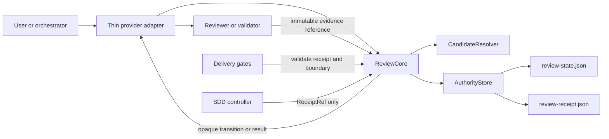
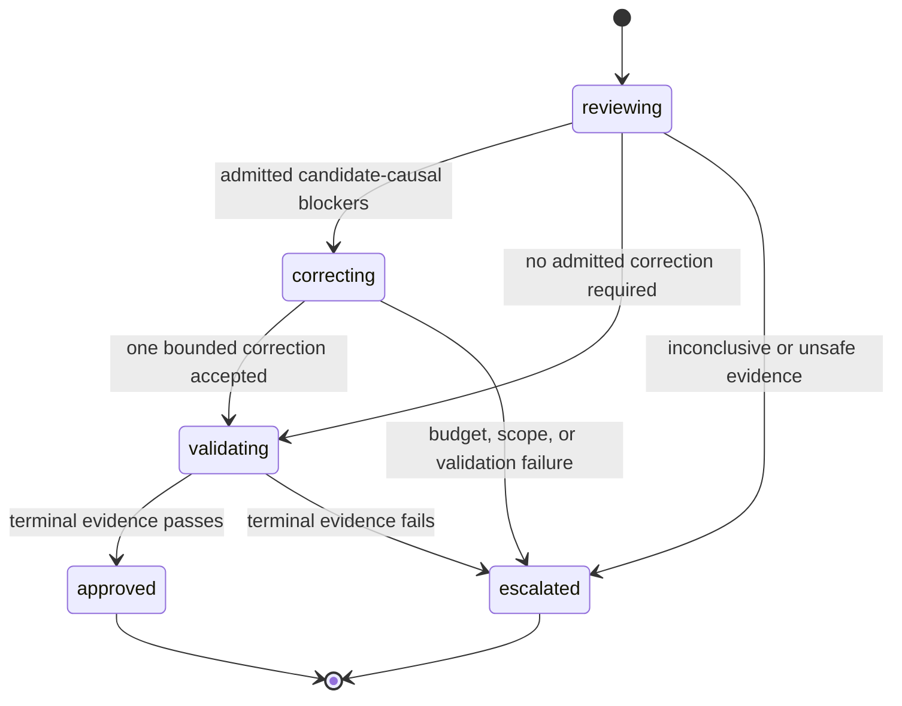

# RDD root simplification design

**Status:** Proposed

## Decision

Receipt-Driven Development (RDD) should be a thin, provider-owned, content-bound approval and delivery-control plane. It must not be the implementation workflow, an adapter-owned state machine, or an SDD lifecycle engine.

For new review lineages, Gentle AI should consolidate RDD behind one native transition owner, one candidate relation algebra, and two active authority artifacts:

1. A mutable CAS authority record.
2. An immutable terminal receipt.

Adapters, SDD, and delivery gates consume provider-issued decisions. They do not infer lifecycle transitions, construct recovery bindings, retain review budgets, or create authority state.

This is a consolidation and migration plan, not a rewrite. It preserves the current security kernel: content binding, atomic authority mutation, explicit consent, bounded correction, kill switch semantics, terminal receipts, and fail-closed behavior.

## Quick path

1. Freeze a normalized candidate only after explicit human consent.
2. Select zero, one, or four review lenses deterministically and freeze the tier and correction budget.
3. Admit only candidate-causal findings; refute or retain non-causal observations without opening correction authority.
4. Permit at most one bounded correction, then run targeted validation.
5. Issue one terminal receipt. Delivery gates only validate that receipt against live boundaries.

The intended lifecycle is:

```text
implement and normalize
  -> deterministic checks
  -> explicit consent
  -> freeze candidate
  -> 0 / 1 / 4 review lenses
  -> candidate-causal admission or refutation
  -> at most one bounded correction
  -> targeted validation and terminal receipt
  -> read-only delivery-gate validation
```

## Problem statement

The prior system audit found a sound trust kernel but a distributed operational state machine. The current snapshot confirms the same root cause persists: individual fixes protect real invariants while expanding the number of routes, contract versions, artifacts, compatibility branches, and recovery operations that must agree.

The resulting failure pattern is predictable:

1. A lifecycle or recovery edge fails in one projection, runtime, or gate.
2. A local patch makes that edge safe.
3. The patch adds a reason code, contract field, command, state field, adapter rule, or persisted artifact.
4. A sibling flow still implements the old interpretation.
5. A later issue reports the same mechanism through another route.

This is not a testing-effort problem. It is an ownership problem. More tests on independently owned transition logic reduce regression risk locally but cannot make the owners agree by construction.

## Evidence and scope

This design is based on read-only evidence. Values below are snapshot-specific and must not be treated as live operational authority.

| Evidence | Value |
|---|---|
| Prior system audit | `docs/audits/2026-07-21-rdd-system-audit.md` (in-repo path; corrected from an external path at landing) |
| Prior audit SHA-256 | `4b41d15aa6c7959628cdd01ef7f759466fc96038948b4ee12c628972441fd923` — recomputed against the in-repo file at landing via `sha256sum`; the measured digest matches |
| Prior audit baseline | `51a5d9e20706b05718b1f2b7fcafda45bab21802` |
| Design snapshot | `origin/main` at `ece470dacd0041f394e7f6f3877a6a9fcb3482af` |
| Snapshot subject | `fix(sdd): prefer approved authority over stale lineage (#2131)` |
| Baseline relationship | The prior baseline is an ancestor of the design snapshot |
| Method | CodeGraph-first source tracing, read-only Git history/diff, GitHub issue/PR evidence, and current-snapshot source inspection |
| `compatible_base_advance` proof source | `internal/reviewtransaction/prepr.go:73`, function `deriveBaseAdvanceCompatibility` — cited as normative semantics, not re-derived (Amendment A) |

The issue and PR mappings in this document are illustrative architecture coverage. They do not prove an issue is fixed, close an issue, approve a PR, or replace current reproduction and review evidence.

## Goals

- Make native RDD authority the only owner of lifecycle transitions and review budgets.
- Use one deterministic candidate identity and relation algebra for start, recovery, SDD binding, and every delivery gate.
- Reduce public state, operations, persisted authority artifacts, and compatibility paths without weakening safety invariants.
- Make the normal public lifecycle `start`, `finalize`, and `validate`; expose status as a read-only view, not a second planner.
- Make recovery a classified graph disposition rather than a growing taxonomy of public maintenance verbs.
- Keep SDD as a consumer of a terminal `ReceiptRef`, not a second RDD implementation.
- Make unsupported runtime transport fail before review authority or review budget is created.
- Remove active compatibility paths only after measured adoption, migration evidence, and a declared support horizon.

## Non-goals

- Do not weaken candidate binding, stale-approval protection, content integrity, CAS, locking, or immutable terminal receipts.
- Do not turn unknown corruption into a best-effort repair.
- Do not add a persisted patch/proof/chunk subsystem.
- Do not add receipt export/import as an implicit solution for independent clones.
- Do not make RDD a generalized transaction engine for implementation, SDD, providers, or deployment.
- Do not rewrite historical authority in place.
- Do not claim that this document authorizes implementation or resolves current operational incidents.

## Non-negotiable invariants

| Invariant | Required behavior |
|---|---|
| Candidate binding | Approval binds exact candidate bytes, paths, modes, projection, policy, and relevant base relation. |
| No floating approval | A branch name, intent, or compatible-looking diff cannot substitute for the frozen candidate. |
| Single writer | Only native authority code writes review state or receipts. |
| Atomicity | Authority mutation uses lock and compare-and-swap; stale or concurrent writes fail. |
| Exact replay | A byte-identical interrupted request may replay without consuming another correction budget. |
| Consent | Human consent is explicit and candidate-bound before a review authority is frozen. |
| Bounded correction | Ordinary review permits one candidate-causal correction within the frozen budget. |
| Receipt finality | A terminal receipt is immutable and never rewritten into a different approval. |
| Gate scope | Delivery gates validate a receipt and live boundary evidence; they never start review or correction work. |
| Kill switch | Disabled RDD means unmanaged ordinary delivery, never synthetic approval. |
| Corruption | Unknown, ambiguous, or unverifiable authority fails closed. |
| Quarantine | Repair preserves bytes and provenance; it never deletes or rewrites history to make it appear valid. |

## Current root-cause model

| Root cause | Current mechanism | Why local fixes recur | Architectural response |
|---|---|---|---|
| Split transition ownership | Facade, status, next transition, adapters, gates, and SDD each derive part of the next action | A correction in one route leaves another route with different logic | One native `ReviewCore` returns the only executable transition |
| Operation-specific target logic | Staged, workspace, committed, overlay, recovery, pre-push, and pre-PR each contain relation variants | Every new projection or base case needs another special path | One normalized candidate and shared relation algebra |
| Replicated contract truth | Runtime code, schemas, fixtures, prompts, help, and adapters have independent projections | A contract can be syntactically valid while a consumer ignores an important capability | One contract model with generated projections and parser-backed conformance vectors |
| Transport mixed with lifecycle | Runtime support is represented inside consent, status, collection, and capture routes | A runtime limitation becomes a lifecycle state and a new contract version | Check capability before freeze; unavailable transport cannot create authority |
| Public recovery taxonomy | Historical anomaly classes became separate verbs and authorization formats | Each anomaly adds a command users and adapters must understand | One classified `repair` disposition facade with private internal handlers |
| RDD/SDD overlap | SDD persists review bindings, attempts, remediation state, and receipt selection behavior | Review changes require corresponding SDD state fixes | SDD stores only receipt references and its own work-unit attempts |
| Delivery semantic branches | Receipts, candidate declines, kill-switch modes, chains, and invalidation writes all alter gate behavior | New delivery exception creates another gate-specific path | Gates validate receipt or report unmanaged ordinary policy only |
| Artifact proliferation | Results, evidence, journals, bundles, descriptors, and sidecars become operational dependencies | Recovery needs more files, handles, and mirror contracts | Two active RDD artifacts and immutable external evidence references |

## Current complexity snapshot

The following counts were measured at the design snapshot. They are not repository-wide codebase totals and should not be compared with a different ref without repeating the measurement.

| Measure | Count | Measurement note |
|---|---:|---|
| Commits after prior audit baseline | 278 | Includes merged side histories introduced after the baseline |
| Merge commits after prior audit baseline | 65 | Git history measure |
| Relevant diff | 528 files, `+135,116/-4,683` lines | `internal/reviewtransaction`, review CLI, SDD status, contracts, docs, bench, and related tests |
| Review/SDD production LOC | 55,077 | `internal/reviewtransaction`, `internal/cli/review*`, and `internal/sddstatus` only |
| Review/SDD test LOC | 80,335 | Same measured path set, test files only |
| Review transaction Go files | 162 | 76 production and 86 test files |
| Review CLI Go files | 146 | 39 production and 107 test files |
| SDD status Go files | 28 | 8 production and 20 test files |
| Review integration schemas | 37 | v1 and v2 contract directories |
| Review integration fixtures | 34 | v1 and v2 contract directories |
| Review/CLI test functions | 1,825 | Prefix-based test-function count |
| Legacy persisted states | 13 | Historical transaction state vocabulary |
| Compact persisted states | 6 | Current compact vocabulary |
| Delivery gates | 5 | `post-apply`, `pre-commit`, `pre-push`, `pre-pr`, `release` |
| Review operation forms | At least 28 | Compact facade, legacy compatibility, review mode, and bundle operations |

The compact state currently contains 36 persisted fields. That count is not itself a defect, but it indicates that several concerns coexist in one authority record: candidate identity, findings, correction planning, validation, invalidation, recovery, result disposition, and historical compatibility.

## Target architecture

### Ownership boundaries

| Component | Owns | Does not own |
|---|---|---|
| `ReviewCore` | Candidate resolution, lifecycle transition, causal admission, correction budget, receipt issuance, repair planning | Model execution, UI routing, SDD progress |
| `AuthorityStore` | CAS authority, exact replay identity, terminal receipt publication | Candidate relation policy, provider behavior |
| `CandidateResolver` | Selector normalization, candidate identity, relation proof | Authority mutation, review execution |
| `ReviewAdapter` | Consent presentation, reviewer invocation, evidence submission | Lineage creation, revisions, recovery classification, budget accounting |
| `DeliveryGate` | Read-only receipt validation for a boundary | Start, correction, invalidation, repair |
| `SDD` | Work-unit attempts, artifacts, archive policy, terminal receipt reference | Review state, target algebra, review recovery |

### Component diagram



The adapter can execute a provider-issued transition or decline it. It cannot construct a command, candidate hash, target relation, lineage, authorization, correction budget, or recovery binding.

## Two-active-artifact model

| Artifact | Lifecycle role | Required contents |
|---|---|---|
| `review-state.json` | Mutable CAS authority | Candidate identity, lifecycle state, tier, selected lenses, one correction budget, admitted finding references, replay identity, current revision |
| `review-receipt.json` | Immutable terminal authorization | Final candidate identity, policy digest, admitted-result/evidence digests, terminal outcome, receipt digest |

The authority record may retain the digest and reference of immutable external evidence. It does not own a separate result-file, proof-file, patch-file, chunk-file, bundle, or transport subsystem.

External evidence policy:

- Reviewer and validator payloads are immutable external content addressed by digest.
- Raw output may be retained by the provider for diagnostics, but it is not authority.
- The receipt binds the accepted evidence digest, not a mutable path.
- A failed or malformed payload never advances state merely because its raw bytes were preserved.
- Exact replay identifies the same request in the authority record; it does not require a public journal command.

## Five-state persisted model

The target reduces new-lineage persisted state to five values. Operational observations are derived rather than stored as state transitions.



| State | Meaning | Permitted next state |
|---|---|---|
| `reviewing` | Candidate, tier, lenses, and budget are frozen | `correcting`, `validating`, `escalated` |
| `correcting` | Candidate-causal findings authorize one bounded correction | `validating`, `escalated` |
| `validating` | Review result is frozen and targeted/final evidence is pending | `approved`, `escalated` |
| `approved` | Immutable terminal receipt exists | Terminal |
| `escalated` | No safe automatic approval remains | Terminal |

`invalidated`, `missing`, `scope_changed`, `ambiguous`, `repairable`, and `corrupted` are derived observations. A delivery gate must not mutate an approved record into an invalidated one. It returns a relation or authority-health result, and a later explicit start may create a new candidate authority.

## Derived categories and reason taxonomy

| Category | Closed vocabulary | Purpose |
|---|---|---|
| Candidate relation | `exact`, `compatible_base_advance`, `provable_contraction`, `changed`, `unrelated`, `ambiguous`, `unknown` | Shared selector, recovery, and gate decision |
| Finding admission | `candidate_causal`, `not_candidate_causal`, `insufficient_evidence` | Determines whether correction authority can exist |
| Authority health | `healthy`, `repairable`, `blocked` | Separates known disposition from unknown corruption |
| Transition result | `continue`, `collect`, `approve`, `escalate`, `repair`, `stop` | Stable adapter-facing outcome |

The public reason code names a situation, not an internal command. An executable response is either an opaque provider-issued transition or no transition. A user-visible message may name an operation only when executing it resolves the reported block.

## Canonical candidate identity and relation algebra

Every selector becomes one normalized candidate:

```text
CandidateIdentity = {
  repository_id,
  base_tree,
  candidate_tree,
  changed_paths_modes_digest,
  policy_hash
}
```

Workspace, staged, committed-range, and workspace-overlay inputs are selector variants. They do not create distinct lifecycle state machines.

The relation function compares a frozen candidate with a live candidate:

| Relation | Proof requirement | Result |
|---|---|---|
| `exact` | Candidate and policy identity match | Continue or validate receipt |
| `compatible_base_advance` | Per `deriveBaseAdvanceCompatibility` (`internal/reviewtransaction/prepr.go:73`): merge-base tree preservation, path digest identity, patch identity, path disjointness, conflict-free `merge-tree --write-tree`, issuer-bound CI attestation and trust root, and base/HEAD non-advance revalidation | Validate same receipt at the new boundary |
| `provable_contraction` | Live delivery is a deterministic subset of reviewed content, and every admitted finding references no excluded path (otherwise degrade to `changed`) | Validate the constrained delivery only |
| `changed` | Any reviewed candidate component differs | Require a new candidate authority after consent |
| `unrelated` | No candidate lineage governs this content | Start a new candidate authority only |
| `ambiguous` | More than one authority is equally applicable | Stop until explicit selection resolves it |
| `unknown` | Evidence cannot prove any prior relation | Fail closed |

### `compatible_base_advance` and `provable_contraction` normative sources

**`compatible_base_advance` (Amendment A).** The proof for `compatible_base_advance` is not re-derived here. It cites the existing implementation in `internal/reviewtransaction/prepr.go`, function `deriveBaseAdvanceCompatibility` (line 73), which requires all seven conditions to hold before treating a base advance as compatible:

1. Merge-base tree preservation — the original reviewed merge-base tree is unchanged.
2. Path digest identity — the delivered paths digest matches the receipt's recorded digest, both before and after the base advance.
3. Patch identity — the original and current patch identities are byte-identical.
4. Path disjointness — the base advance's changed paths do not overlap the delivered candidate's changed paths.
5. Conflict-free merge — `git merge-tree --write-tree` against the new base produces a merged result tree with no conflicts.
6. Issuer-bound CI attestation — the merged result is covered by a CI attestation artifact bound to a trusted issuer.
7. Base/HEAD non-advance revalidation — the pre-PR base selection and HEAD commit are re-resolved and must match the values captured at proof time; a base or HEAD that advanced during validation invalidates the proof.

This is normative semantics, not an illustrative example: a future change to `compatible_base_advance`'s proof requirement is a change to `deriveBaseAdvanceCompatibility`, and any change to that function is a change to this design's relation algebra.

**`provable_contraction` (Amendment B / Decision 6).** `provable_contraction` validates only when every admitted finding references no excluded path. If any admitted finding references a path outside the delivered candidate's live scope, the relation degrades to `changed` rather than validating as a contraction. This closes a soundness gap where a narrowed delivery could otherwise inherit approval for content it no longer includes.

This function is the only place allowed to decide relation. `start`, recovery, SDD receipt binding, and all five delivery gates call it.

## Deterministic selector and discovery

The selector receives a repository handle and an explicit target request. It returns one of the following without mutating authority:

1. A normalized candidate identity.
2. A deterministic authority match and relation.
3. A complete ambiguity set.
4. A typed failure with evidence.

Discovery rules:

- Repository identity is canonical and worktree-aware.
- Linked worktrees share local authority through the Git common directory.
- Independent clones have no inherited local authority and must re-review unless a separate authenticated transport is explicitly designed and approved.
- A selected lineage is never inferred from recency when more than one valid candidate applies.
- A no-op candidate does not create a delivery-chain receipt. It has no review content to govern.
- A selector does not scan or materialize unrelated repository content merely to admit bounded evidence references.

## Review, consent, correction, and kill-switch semantics

### Consent

`start` presents the exact normalized candidate, tier, selected lenses, and expected correction budget. Authority is frozen only after explicit consent.

Consent is not a receipt. It authorizes a review attempt for one candidate; it never authorizes later delivery.

### Review tier and causal admission

- Tier `0` performs no reviewer lens and proceeds through deterministic validation.
- Tier `1` runs one dominant-risk lens.
- Tier `4` runs the frozen four-lens set.
- Tier and selected lenses are immutable for the candidate.
- A finding can authorize correction only when its candidate relation and evidence are admitted as `candidate_causal`.
- Non-causal or insufficient findings become follow-up information and cannot consume correction authority.

### One correction

One correction is a single transaction:

1. The provider issues a bound correction request.
2. The correction plan and changed candidate are checked against frozen finding IDs, paths, and budget.
3. Targeted validation proves both original criteria and correction regression criteria.
4. Passing validation advances to `validating`; failure escalates.

Procedural retry before mutation is exact replay. It is not an additional correction.

### Kill switch and declined review

The user-owned kill switch has one meaning: RDD is disabled and delivery remains governed by ordinary repository policy. It does not fabricate approval, create a receipt, or reopen historic review authority.

The current candidate-decline authorization is a separate delivery branch. The recommended default is to remove it from the RDD authority model: a declined review should produce an explicit unmanaged outcome and return control to ordinary policy, not persist a receipt-like delivery authorization. If product requirements require persistence, it must remain a narrowly scoped non-approval declaration with no release authority and no reuse across candidate changes.

## Receipt-only delivery gates

Each gate calls the same read-only validation operation with a boundary descriptor:

| Gate | Boundary evidence |
|---|---|
| `post-apply` | Current implementation candidate |
| `pre-commit` | Exact staged candidate |
| `pre-push` | Delivery range and remote boundary |
| `pre-pr` | Candidate and base relationship |
| `release` | Exact release target, publication boundary, and release evidence |

The gate either validates the terminal receipt against the live boundary or denies it with a derived relation. It never:

- starts review;
- creates correction authority;
- consumes a budget;
- invalidates a receipt by mutating authority;
- creates a recovery lineage;
- composes an unrelated receipt graph to invent delivery authority.

## Recovery and quarantine algebra

Recovery is a graph-disposition problem. It is not a collection of user-selected repair verbs.

For an authority graph `G`, a classified anomaly has seed set `S`. Its disposition closure is:

```text
closure(S) = S plus every transitive descendant whose retained predecessor chain would otherwise be invalid
```

The provider derives a disposition plan from the inspected graph:

```text
DispositionPlan = {
  repository_id,
  authority_inventory_revision,
  anomaly_class,
  ordered_seed_set,
  ordered_closure,
  expected_revisions,
  plan_digest,
  actor,
  reason,
  authorization
}
```

Execution rules:

1. Inspect the graph read-only and classify only closed, evidence-backed anomaly types.
2. Derive the seed set and closure deterministically.
3. Bind authorization to repository identity, inventory revision, plan digest, actor, reason, and exact affected records.
4. Re-inspect under the maintenance lock and CAS boundary.
5. Quarantine exact authority bytes and preserve residue for forensic inspection.
6. Revalidate the retained graph before reporting success.
7. Exact replay converges without moving entries twice.

### #1892 before #2014

| Scope | Rule | Safety boundary |
|---|---|---|
| #1892 leaf-only repair | Enable only a classified malformed leaf where `closure(S)` has cardinality one | A non-leaf is refused; no predecessor pointer is rewritten |
| #2014 descendant closure | Later enable atomic disposition of the full transitive closure | The plan must preserve valid unrelated history and revalidate the retained graph |

This ordering is intentional. A leaf quarantine proves classification, authorization, lock/CAS, replay, and residue preservation with limited blast radius. It does not prove that multi-node closure disposition is safe.

Unknown, mixed, ambiguous, or unsupported anomaly shapes remain `blocked`. There is no generic quarantine fallback.

## Provider, OpenCode, Pi, and SDD boundaries

| Boundary | Target responsibility |
|---|---|
| Native provider | Resolve candidate, issue opaque transitions, validate evidence, mutate authority, issue receipt, classify repair |
| OpenCode | Present consent, execute provider-issued reviewer work when capability exists, submit immutable result reference |
| Pi | Same thin adapter role: invoke provider, execute issued work, render result; no lifecycle routing |
| Other providers | Declare one capability: can or cannot transport immutable candidate inspection and result submission |
| SDD | Store its own work-unit attempts and a terminal `ReceiptRef`; request receipt validation when needed |

Runtime capability is checked before candidate freeze. A runtime without a complete immutable transport cannot create review authority, selected-lens budget, collection slots, or incomplete reviewer loops.

The adapter receives an opaque transition reference. It does not receive a set of raw flags, a mutable working-directory dependency, or an authority revision it must reconstruct. The provider resolves repository context from the bound handle.

## Control reduction matrix

| Current control or surface | Action | Target disposition |
|---|---|---|
| Candidate identity, path/mode binding, policy binding | KEEP | One canonical `CandidateIdentity` |
| CAS, locks, atomic mutation | KEEP | Internal authority-store behavior only |
| Immutable terminal receipt | KEEP | Sole RDD delivery authorization |
| Explicit human consent | KEEP | Required before freeze |
| One bounded correction | KEEP | Frozen budget and one consumption flag |
| User-owned kill switch | KEEP | One mode; disabled means unmanaged, never approved |
| Historical action, next transition, command strings, descriptors | MERGE | One opaque provider-issued transition reference |
| Status, facade routing, and adapter routing | MERGE | Native `ReviewCore` owns transition selection |
| Per-operation recovery verbs | MERGE | One classified repair/disposition facade |
| Manually maintained schemas, fixtures, decoders, help copies | DERIVE | Generated projections from one contract model |
| Candidate-decline authorization | DOWNGRADE | Ordinary unmanaged policy or a strictly non-approval declaration |
| Gate invalidation writes | REMOVE | Gate returns a derived mismatch only |
| Legacy mutation lifecycle | REMOVE | Read-only compatibility and offline migration only |
| Result sidecars, public journals, bundles, proof/chunk persistence | REMOVE | Immutable external evidence references only |
| Runtime-specific lifecycle routes | REMOVE | One pre-freeze capability decision |
| Unknown authority corruption | FAIL-CLOSED ONLY | No generic repair |
| Ambiguous selector, stale approval, changed content | FAIL-CLOSED ONLY | Explicit new candidate or exact replay only |
| Known classified anomaly | KEEP | Opaque CAS-bound disposition plan |

## Migration waves

Each wave is a dependency boundary, not a large PR. A wave must prove its exit evidence before the next wave starts. Existing authority is never translated in place.

| Wave | Scope and dependency | Rollback boundary | Exit evidence | Deletion outcome |
|---|---|---|---|---|
| 0. Freeze expansion | Stop additive old-facade recovery and transport work except proven security defects; inventory owners and consumers | No behavior change | Inventory maps each transition, artifact, and consumer to one owner | Prevent new state/verb growth |
| 1. Shadow algebra | Read-only candidate resolver, relation algebra, and graph classifier | Disable shadow evaluation | Differential matrix covers all selector, base, contraction, ambiguity, and unknown cases — see `internal/reviewtransaction/testdata/shadow-differential-matrix.golden` (40-row covering array, generated by `TestShadowMatrixCoveringArrayGolden`): 16 agreement, 12 explained divergence (Amendment B degradation and the shadow-only `unrelated` vocabulary gap), 8 no-live-decision (`ambiguous`/`unknown`), 4 no-shadow-decision, 0 unexplained divergences on `exact`/`compatible_base_advance`/`provable_contraction` — clean exit bar. Operator-facing usage: `docs/architecture/rdd-shadow-evaluation.md` | None |
| 2. Leaf disposition | Generic disposition plan with #1892 leaf-only executor | Disable this new classified repair | Black-box repair, replay, crash, concurrency, refusal, and retained-graph validation | Do not merge a dedicated repair-verb taxonomy as the target design |
| 3. New-lineage facade | New `start/finalize/validate` authority flow with two artifacts | Disable new starts; historical authority remains readable, but per the coexistence precedence (Amendment C) it never authorizes delivery of a candidate that has a new lineage | End-to-end candidate, consent, 0/1/4 review, correction, receipt, and gate journeys | New lineages stop writing legacy state/artifacts |
| 4. Thin consumers | Move adapters and SDD to opaque transitions and `ReceiptRef` | Per-adapter unavailable mode; no unsafe fallback | Real runtime evidence for each declared supported transport | Remove client planners and SDD review-binding mirrors for migrated consumers |
| 5. Gate cutover | All gates use shared relation algebra and read-only receipt validation | Gate may deny; it cannot revive legacy mutation | Exact and incompatible boundary matrix for all five gates | Remove gate invalidation writes and chain-specific delivery exceptions |
| 6. Descendant closure | #2014 atomic closure disposition after leaf repair evidence | Disable closure executor while retaining inspection | Multi-chain closure, unchanged unrelated graph, replay, and crash-recovery evidence | Remove overlapping anomaly-specific repair paths |
| 7. Compatibility retirement | Enforce the declared horizon and preserve read-only forensic access | Offline parser remains available | No supported consumer calls retired contract; historical parse/migration checks pass | Delete legacy mutation paths, bundle workflows, sidecars, and duplicate contract projections |

**Coexistence precedence (Amendment C / Decision 7).** While Wave 3 is active, legacy readable authority and new-lineage authority coexist. Legacy readable authority never authorizes delivery of a candidate that has a new lineage; only a new-lineage receipt can authorize delivery for a new-lineage candidate. This precedence rule governs every gate during the coexistence window and is the basis for the `Coexistence precedence` row in the adversarial safety analysis below.

**Wave 3 exit-evidence pointer.** The `End-to-end candidate, consent, 0/1/4 review, correction, receipt, and gate journeys` cell above is proven piecewise across Slices 1-5, not as one fixture: promotion/rename (`internal/reviewtransaction/candidate_readonly_guard_test.go`), the v3 `AuthorityStore` CAS/lock/replay/receipt model (`internal/reviewtransaction/authority_store_test.go`), `ReviewCore` start/finalize/validate with reused consent/tier/budget (`internal/reviewtransaction/review_core_test.go`), the Amendment C governing-authority matrix and switch-off byte-equivalence at all five gates (`internal/reviewtransaction/new_lineage_discovery_test.go`, `internal/cli/review_new_lineage_switch_off_golden_test.go`), rollback safety (`internal/cli/review_new_lineage_rollback_safety_test.go`), the reason-taxonomy regression (`internal/cli/review_reason_taxonomy_test.go`), the gate-accurate live-evidence selector (`internal/cli/review_new_lineage_gate_selector_test.go`), and black-box lifecycle coverage through the built binary (`bench/journeys_wave3.go`, `j59`/`j60`). Deferred, and documented rather than silently missing: `review finalize` is not yet CLI-wired for new lineages (only `start`/`validate` are), so a genuine tier 0/1/4 flow reaching receipt issuance through the product's CLI surface — as opposed to `ReviewCore`/`AuthorityStore`'s Go API, which the rollback-safety test already drives to a receipt — remains a later wave's work; `OfferReviewAfterVerify` (`internal/reviewtransaction/review_offer.go`) ships its Wave 4 shape unwired per design decision 8, with its one required behavior (kill-switch-off returns before any repository read) covered by `internal/reviewtransaction/review_offer_test.go`.

## Migration chain and delivery plan

The wave table above is a dependency boundary; this section documents how waves are delivered as reviewable pull requests.

- **Tracker branch**: `feature/rdd-root-simplification`, created off `main` at `ece470dacd0041f394e7f6f3877a6a9fcb3482af`. The tracker is a draft/no-merge PR to `main` that aggregates every wave slice.
- **Child PR targeting**: PR #1 targets the tracker branch. PR #n (n > 1) targets PR #(n-1)'s branch. No child PR targets `main` directly.
- **Merge rule**: only the tracker PR merges into `main`, once every wave's exit evidence is proven and every child PR is reviewed and integrated onto the tracker.
- **Review budget**: approximately 1000 changed lines per PR (`review_budget_lines: 1000`), sourced from this design's own PR-slicing preview and the Wave 0 proposal's chain-plan deliverable, not from `openspec/config.yaml`.
- **Diff hygiene**: if GitHub shows a previous slice's content inside a child PR's diff, retarget or rebase that child PR until the diff shows only its own work unit.
- **Wave gating**: a wave's exit evidence (from the migration-waves table above) gates the next wave's slice; no wave starts its PR chain before the prior wave's exit evidence is proven.

## Issue and PR coverage map

This table describes where the target architecture would address known families. It is not an exhaustive closure map.

| Target root fix | Illustrative issues and PRs |
|---|---|
| Shared candidate relation algebra | #1453, #1523, #1563, #1590, #1736, #1740, #1758, #1762, #2126, #2160, #2169 |
| Single transition owner and generic finalization | #1611, #2050, #2103, #2233 |
| Capability before lifecycle mutation | #2076, #2207, #2221, #2225, #2191 |
| Classified authority disposition | #1656, #1892, #2014, open PR #2111 |
| Thin RDD/SDD bridge | #1533, #1552, #1569, #1581, #1620, #1708, #1715, #2131 |
| Receipt-only delivery validation | #1379, #1801, #2046, #2126, #2222, #2239 |
| Bounded immutable candidate evidence | #1454, #1484, #1528, #1555, #2061 |
| Retire legacy active paths | #1455, #1462, #1570 and legacy repair/quarantine command families |

## Deletion plan

| Surface to retire | Proof required before deletion |
|---|---|
| Client routing from historical `action` | Every supported adapter executes opaque provider-issued transitions in black-box tests |
| Raw temporary result transport and capture sidecars | Every supported adapter submits immutable evidence references through the new facade |
| Public cause-specific recovery verbs | Classified repair covers supported anomaly classes; unsupported classes remain explicit stops |
| Bundle import/export in the active lifecycle | Product explicitly documents independent clones as re-review; no supported consumer depends on local bundle transfer |
| Legacy mutation state machine | New lineages cannot write it; historical records parse read-only; migration horizon has elapsed |
| SDD review-binding and remediation mirrors | SDD consumes `ReceiptRef` and all review validity checks call native validation |
| Gate invalidation writes and delivery graph exceptions | All five gates prove exact, compatible, contraction, changed, ambiguous, and unknown behavior through the shared algebra |
| Manually authored schema/fixture/decoder duplicates | Generated artifacts and production-parser conformance vectors are required in CI |
| Candidate-decline authority records | Maintainer decides unmanaged semantics and proves ordinary policy cannot mistake a decline for approval |

Historical receipts, journals, bundles, and quarantined residue remain forensic evidence. Deletion applies to active routing and mutation paths, not historical bytes.

## Adversarial safety analysis

| Risk | Unsafe simplification | Required mitigation |
|---|---|---|
| Stale approval | Reuse a receipt after candidate or policy drift | Bind every receipt to canonical candidate identity; relation must be `exact`, `compatible_base_advance`, or proven contraction |
| Bypass through adapters | Let Pi or OpenCode reconstruct flags, revisions, or recovery choices | Provider issues opaque transitions; adapters cannot author lifecycle authority |
| Data loss during repair | Delete or rewrite malformed authority | Byte-preserving quarantine, closure derivation, CAS reinspection, retained-graph validation |
| Nondeterministic selector | Choose newest or first matching lineage | Return the complete ambiguity set and require explicit selection |
| Incompatible base advance | Treat any rebase as compatible | Compare normalized patch/path/mode semantics and merge-safety proof per `deriveBaseAdvanceCompatibility` (`internal/reviewtransaction/prepr.go:73`); otherwise require a new candidate |
| Independent clone reuse | Assume `.git` authority travels with Git objects | Re-review by default; authenticated transport is a separate product decision |
| Budget reset | Treat replay or procedural retry as a fresh correction | Store exact replay identity and a single correction-consumed flag in authority |
| Consent bypass | Interpret absent, malformed, or stale consent as approval | Freeze only after explicit consent; unreadable state fails closed |
| Unsupported transport loop | Freeze a review that a runtime cannot inspect or submit | Capability check before authority, tier, lens, or budget creation |
| Gate-created state | Mutate receipt authority during delivery validation | Gates are read-only and return derived mismatch only |
| Unsound contraction (Amendment B) | Validate a contraction whose admitted findings reference an excluded path | The `provable_contraction` relation degrades to `changed` when any admitted finding references a path outside the delivered candidate's live scope |
| Coexistence precedence (Amendment C) | Let legacy readable authority authorize delivery of a new-lineage candidate | Legacy readable authority never authorizes delivery of a candidate that has a new lineage; only the new-lineage receipt governs new-lineage delivery |
| Cross-lineage receipt contamination (Amendment E, #1379) | Accept a receipt whose candidate identity or lineage does not match the live candidate under review — audit-flagged potentially severe | Receipt validation binds exact candidate identity per lineage and repository identity; a receipt issued for a different lineage never satisfies gate validation |

## Unresolved maintainer and product decisions

| Decision | Recommended default | Tradeoff |
|---|---|---|
| Declined review semantics | Return explicit unmanaged ordinary delivery; do not persist a receipt-like decline authorization | Less resumability, much smaller delivery state model |
| Unsupported runtime behavior | Fail RDD before freeze and let the user explicitly choose unmanaged ordinary delivery when policy allows | Some runtimes cannot use RDD until they provide a real immutable transport |
| Repair authorization | Require a maintainer-bound disposition plan with repository, inventory revision, closure, actor, reason, and expiry | More authorization ceremony, but it is concentrated in one operation rather than every repair verb |
| Compatibility horizon | Declare a short, version-pinned read-only compatibility horizon for legacy authority and clients | Older consumers must upgrade or use offline migration |
| Receipt transport between clones | Do not provide it by default | Re-review costs time; authenticated transport requires repository identity, signing, expiry, revocation, and replay design |
| Release evidence | Keep equivalent release provenance and boundary evidence outside a simplified receipt payload | Release validation remains strict even if the receipt is smaller |
| External evidence retention horizon (Amendment D / Decision 8) | Retain digests indefinitely in authority; raw payloads are provider diagnostics with a declared expiry | Indefinite digest retention adds small storage cost; a declared payload expiry bounds forensic replay depth |
| SDD attempt-ledger ownership (Amendment D / Decision 9) | Keep attempts in SDD only if its store gains durable cumulative CAS-like properties; otherwise move attempts to native authority | Conditional ownership avoids a premature commitment, but requires re-litigating placement once SDD's store properties are known |

## Acceptance criteria

- [ ] One native owner is the only component that selects lifecycle transitions and mutates review authority.
- [ ] New lineages persist only the authority record and terminal receipt as active RDD artifacts.
- [ ] One candidate relation algebra is used by start, recovery, SDD receipt binding, and all five gates.
- [ ] New-lineage state is limited to `reviewing`, `correcting`, `validating`, `approved`, and `escalated`.
- [ ] Ordinary review permits exactly one candidate-causal bounded correction; exact replay does not consume it.
- [ ] Adapters cannot construct lifecycle flags, revisions, recovery bindings, or budget state.
- [ ] Unsupported transport fails before consented authority freeze and cannot create a collection loop.
- [ ] Gates are read-only receipt validators and never create review or correction state.
- [ ] #1892 leaf repair is separately proven before #2014 descendant-closure disposition is enabled.
- [ ] Unknown corruption, ambiguous discovery, stale approvals, and incompatible base movement remain fail closed.
- [ ] Every retired path has a measured consumer inventory, migration boundary, and deletion proof.
- [ ] `provable_contraction` degrades to `changed` when admitted findings touch any excluded path (Amendment B).

## Adopted next-step decisions

The list below was originally proposed for maintainer approval. Per the Wave 0 proposal's default-adoption table, decisions 1–5 are adopted as specified, pending explicit maintainer amendment; decisions 6–9 are encoded directly into the sections above via Amendments B, C, and D.

1. The five-state new-lineage model and two-active-artifact rule are adopted as specified.
2. The shared candidate relation algebra and read-only gate rule are adopted; gates never mutate authority.
3. The declined-review and unsupported-runtime product semantics are adopted: unmanaged ordinary delivery applies, and the process fails before freeze.
4. The repair-authorization shape and compatibility horizon are adopted: a maintainer-bound disposition plan and a short, version-pinned read-only compatibility horizon.
5. The wave order is adopted: Wave 1 as a read-only equivalence exercise, followed by #1892 leaf-only disposition work; #2014 remains deferred until leaf repair has independent safety evidence.

## Amendment log

| ID | Sections touched | Edit shape |
|---|---|---|
| A | `Canonical candidate identity and relation algebra` (relation table `compatible_base_advance` row + new subsection) + `Adversarial safety analysis` (`Incompatible base advance` row) + `Evidence and scope` (new proof-source row) | Cites `internal/reviewtransaction/prepr.go` `deriveBaseAdvanceCompatibility` (line 73) as normative semantics for all seven conditions instead of re-deriving them |
| B | Same relation table (`provable_contraction` row) + same new subsection + `Adversarial safety analysis` (new `Unsound contraction` row) + `Acceptance criteria` (one bullet) | `provable_contraction` degrades to `changed` when admitted findings reference an excluded path |
| C | `Migration waves` (Wave 3 row, `Rollback boundary` cell) + new precedence note under the wave table + `Adversarial safety analysis` (new `Coexistence precedence` row) | Legacy readable authority never authorizes delivery of a candidate that has a new lineage |
| D | `Unresolved maintainer and product decisions` (two new rows, same `Decision / Recommended default / Tradeoff` columns) | Adds decision 8 (external evidence retention horizon) and decision 9 (SDD attempt-ledger ownership) |
| E | `Adversarial safety analysis` (new `Cross-lineage receipt contamination` row) + `Issue and PR coverage map` (`Receipt-only delivery validation` row gains `#1379`) | One coverage row only — the map is a coverage index, not a duplicate index |
