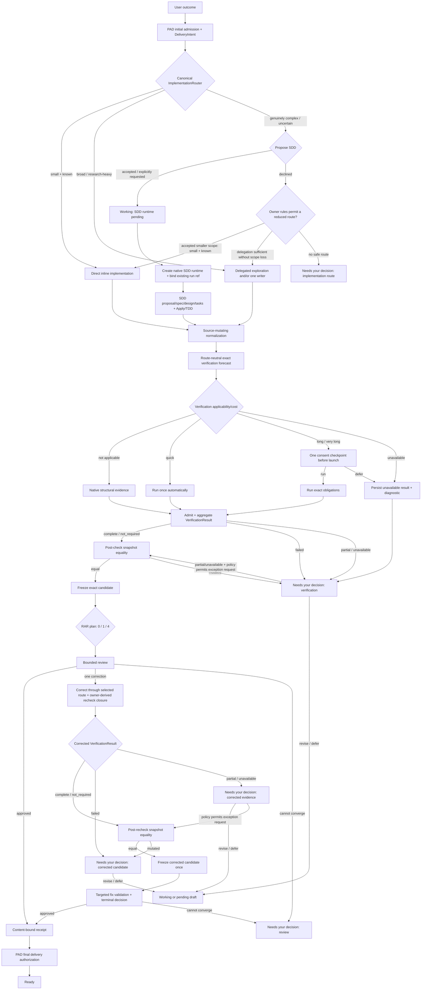

# Organic Recovery Architecture and Implementation Plan

- **Decision date:** 2026-07-23
- **Status:** Gentle AI provider release-ready subject to exact-candidate CI; 51 of 52 acceptance criteria proved; ecosystem activation remains pending on the sole deferred Gentle Pi consumer matrix
- **Architecture baseline:** `main` at `0d95c399c79edb341e3d874032eba4654b2b3f17`
- **Implementation baseline:** `main` at `0d216f26d1e2fdb21f6fcfbefa05a1767f92eba8`
- **Parent architecture:** [Systemic Remediation Architecture](./2026-07-23-systemic-remediation-architecture.md)
- **Scope:** canonical implementation routing, optional SDD planning, proportional verification, the common RAR/PAD handoff, an outcome-first user experience, and typed delivery routes
- **Delivery posture:** provider-first GO: merge and publish Gentle AI after freezing and validating the exact candidate; keep default/unset activation read-only and do not claim ecosystem activation until Gentle Pi passes its subsequent provider-version/consumer matrix

> **Decision:** Restore Gentle AI's organic “ask for the outcome” experience without removing its trust kernel. Keep byte integrity, immutable candidate identity, typed evidence, bounded review, receipts, and gate revalidation invisible behind one provider-owned safety envelope shared by multiple implementation routes. Make semantic verification proportional to applicability, risk, and cost; surface only decisions that materially affect the user's intent, exposure, or delivery.

> **Implementation audit:** Gentle AI now composes the productive path end to
> end: normal outcome-only intake, authenticated connector/bootstrap, semantic
> evaluation, live policy provisioning, exact Git candidate authority,
> hosting/PAD probe and execution, connectorless recovery, and route-neutral
> terminal replay. The pinned real-agent suite passes all four direct,
> delegated, common-review, and kill-switch journeys. Independent adversarial
> review reports PASS with P0/P1/P2 = 0/0/0. The provider is therefore
> release-ready at 51 of 52 criteria. The sole unchecked criterion is the
> downstream Gentle Pi provider-version/consumer matrix. Publishing the
> provider does not activate the ecosystem: the canonical manifest and unset
> runtime mode remain dormant/read-only, while effective advertisement still
> requires explicit enabled mode and an authenticated repository- and
> agent-bound connector.

This is a recovery slice within the nine-context systemic architecture, not a replacement architecture and not a second workflow engine. It normalizes the orchestrator's existing delegation rules, makes SDD one optional implementation route, and changes the `EPD`, `RAR`, `SDD`, and `PAD` handoffs while consuming existing `HCR`, `MMI`, and `ACI` ports. Direct and delegated work must not create synthetic SDD runs. The product invariant is end-to-end: a person asks for an outcome, the system performs the necessary work and proof, and the person sees either **Ready** or one actionable decision. The slice must preserve the one-way dependency rules and authority ownership from the parent architecture.

## 1. Executive decision

Gentle AI should return to a simple public mental model:

1. The user asks for an outcome.
2. PAD records an initial admission decision and typed delivery intent.
3. The canonical implementation router selects direct execution, delegated execution, or proposes SDD.
4. Small, already-understood work executes inline. Broader or research-heavy work uses the smallest useful subagent workflow. Genuinely complex work enters SDD only after the proposal is accepted or when the user explicitly requested SDD.
5. An accepted or explicit SDD route remains **Working** while the consumer creates a native SDD runtime and binds that already-existing runtime; it never asks for route consent twice.
6. Every implementation route converges on the same normalization, proportional verification, RAR review, and PAD authorization.
7. PAD authorizes the selected delivery route against the final receipt and live destination.
8. The user sees either a ready result or one bounded decision. A terminal delivery ambiguity stops once and offers only the exact owner-issued recovery action.

The public product exposes only four states:

| Public state | Meaning |
|---|---|
| **Working** | The implementation can still change. |
| **Checking** | The system is performing the applicable functional proof and bounded adversarial review. |
| **Ready** | The exact candidate has sufficient evidence for its selected delivery route. |
| **Needs your decision** | Safe automatic convergence is impossible; the user receives the cause, impact, and a small set of concrete choices. |

Hashes, lineages, revisions, locks, actor tickets, attempt ordinals, recovery classes, receipts, and lifecycle operations remain available to maintainers and support tooling, but they are not the normal user's workflow.

### Non-negotiable constraints

- No second SDD review state machine, authority kernel, or evidence ledger.
- No SDD artifacts, phase prompts, or SDD attempt ledger for `direct_inline` or `delegated_direct`.
- No delegation trigger may be interpreted as automatic SDD admission. Implementation routing and safety classification remain independent.
- No model-authored `not_applicable`, identity, hash, authorization, or PASS.
- No loop-until-clean review or verification.
- No silent downgrade from missing or expensive proof to approval.
- No requirement that every delivery use both an issue and a pull request.
- No route may weaken immutable candidate identity, managed mutation integrity, receipt binding, remote revalidation, or repository protection.
- No consumer may author an SDD decline fallback, infer a recovery action from prose, retry `work-start` after an ambiguous result, or invoke delivery reconciliation automatically.
- No optional fields may be added to the existing `sdd-status` v1 response because Gentle Pi decodes that shape exactly.
- A kill switch may disable the new capability or reduce it to read-only diagnostics; it may not restore consumer-side inference or prose authority.

## 2. Problem and evidence

### 2.1 Product failure

The four-R review model improved investigation and found risks that the previous organic workflow missed. It also turned internal safety machinery into a user-visible ceremony:

- simple document or visual-asset work can launch the same verification phase as executable behavior;
- functional verification, adversarial review, correction, and gate checks can appear as repeated reviews of the same fact;
- expensive, environment-dependent, or impossible checks are discovered only after the system starts them;
- missing tools and timeouts can lead to retries or opaque blocking states;
- the user has to understand review internals to recover;
- issue-first and pull-request-first governance is treated as if it were universal security policy;
- ordinary subagent delegation and full SDD planning are conflated even though they solve different complexity problems;
- SDD, RDD, gates, CLI adapters, and Gentle Pi can each infer a next action.

The result is safe stopping without an operable path forward. Users who were satisfied with “build this for me” encounter review vocabulary, repeated prompts, and non-convergent flows after the implementation is already correct.

### 2.2 Systemic evidence

The parent audit proved that ticket-by-ticket remediation is the wrong strategy:

- the live-normalized collision graph contains **90 PRs and 499 overlap edges**;
- **74 PRs form one collision component** spanning eight canonical contexts;
- **16 PRs require decomposition** because they cross too many contexts or act as oversized collision hubs.

This recovery therefore cannot be another sequence of isolated workflow patches. It must establish one implementation-route decision before any optional SDD lifecycle, one owner for each safety decision, and one explicit handoff into RAR, EPD, and PAD.

### 2.3 Existing implementation seams

Gentle AI already contains reusable foundations:

| Existing seam | Reuse decision |
|---|---|
| [Generic orchestrator delegation rules](../../internal/assets/generic/sdd-orchestrator.md#delegation-rules) and their adapter projections | Preserve the canonical thresholds: read 1–3 files to decide/verify inline; delegate narrow exploration when understanding requires 4+ files; keep one already-understood mechanical file inline; delegate one writer for 2+ non-trivial files and delegate execution-heavy tests/builds when supported. The [Codex projection](../../internal/assets/codex/sdd-orchestrator.md#general-delegation-rules-always-active) explicitly applies these rules to all non-trivial work, not only SDD phases. They are ordinary orchestration rules, not SDD admission. |
| `internal/reviewtransaction/risk.go` | Reuse native path/content risk assessment, operational Markdown detection, and static MDX inspection. Extend it through an owner-issued applicability contract rather than file-extension heuristics. |
| `NativeLowRiskVerificationEvidence` in `internal/reviewtransaction/compact.go` | Retain only as post-freeze RAR evidence for a genuine low-risk, zero-lens review. It cannot prove pre-review applicability because it requires an existing frozen compact state. |
| `RuntimeStore` and SDD CAS records | Extract/reuse the route-neutral verification reservation/result core as `WorkRunStore`. SDD composes it with its phase graph and budgets only when SDD was selected; direct and delegated work never become fake SDD runs. |
| `CandidateIdentity`, review authority, and immutable receipts | Preserve unchanged as the trust kernel. |
| `applyPreVerifyReviewRouting` in `internal/sddstatus/status.go` | Replace the current review-before-final-verification ordering with functional verification before the review candidate is frozen. |
| `gentle-ai.sdd-status` v1 | Introduce an explicit strict v1 projection for legacy SDD consumers that matches the current Gentle Pi decoder and cannot leak `runtimeStatus`, `remediationState.correctionBudget`, new root keys, or work-contract-only next-action tokens. |

Pre-review `not_applicable` requires a new RAR-owned applicability decision bound to the post-normalization snapshot and supported by EPD-admitted evidence. It must not reuse the RAR-only low-risk evidence preimage.

## 3. Product contract

### 3.1 Implementation routing before lifecycle

The parent orchestrator applies its always-active delegation rules before deciding whether SDD is useful:

| Route decision | Canonical trigger | Behavior |
|---|---|---|
| `direct_inline` | Decide/verify from 1–3 files, or perform one mechanical, already-understood file change with no research or unresolved design decision | Keep the work inline. Create no SDD change, artifact graph, phase prompt, or SDD attempt. |
| `delegated_direct` | Understanding requires 4+ files; reading prepares a write; implementation touches 2+ non-trivial files; or broad research/context compression is needed to establish the implementation | Use the smallest useful native implementation topology: a narrow explorer and/or one writer according to the fired rule. Create no SDD lifecycle. The common verification and review flow is selected independently afterward. |
| `propose_sdd` | The work is genuinely substantial or ambiguous and durable proposal/spec/design/task decisions would materially reduce cross-context, architectural, security, migration, rollback, or multi-unit uncertainty | Explain why SDD would help and offer it. This is a pending decision, not an implementation route. The selected route becomes `sdd` only after acceptance or when the user explicitly requested SDD. |

The 4-file rule is **4 or more files needed to understand the work**. It is not a changed-file limit and not an SDD threshold. Likewise, the 2-file rule means **2 or more non-trivial files to implement** and selects one delegated writer, not SDD. Risk alone selects stronger verification/review; it does not force SDD when the work remains local and already understood.

The delegation contract applies per action, not only once per work item. A `direct_inline` implementation may still delegate execution-heavy tests, builds, installs, or common review actors without being relabeled `delegated_direct`; that downstream delegation also does not trigger SDD.

If an apparently simple task reveals genuine complexity, the router may propose SDD at the next safe boundary. It may not silently enroll the work, retroactively fabricate SDD artifacts, or treat rejection as permission to continue unsafely. It must reduce scope, continue through a safe direct/delegated route, or return **Needs your decision**.

The router emits an `ImplementationRouteDecision` with `direct_inline`, `delegated_direct`, or `propose_sdd`. Only a selected executable route—`direct_inline`, `delegated_direct`, or `sdd`—is persisted as `ImplementationRoute` in a `WorkRun`; `sdd` additionally requires acceptance unless the user requested it explicitly.

`gentle-ai.work-route/v1` makes that boundary explicit:

- `work-route decide` accepts only the human choice `accept_sdd` or `decline_sdd`. The consumer cannot submit a replacement route or routing facts.
- The provider persists the safe decline fallback with the original `propose_sdd` authority. A decline selects only that owner-authored `direct_inline` or `delegated_direct` fallback; if none exists, the decision fails closed.
- Acceptance, and an explicit SDD request at `work-start`, both produce `publicState: working` with `routePhase: sdd_runtime_pending`. The route is already accepted; this is not another decision state.
- The consumer creates the native SDD runtime first, then uses `work-route bind-sdd` to bind that already-existing run reference. Binding moves the same WorkRun to `routePhase: implementation_selected` with `implementationRoute: sdd`; it cannot create either run or attach a foreign one.

Implementation route is a context-management and planning choice, not a safety profile. Direct work receives the same candidate identity, proportional verification, RAR receipt, and PAD delivery checks as delegated or SDD work.

### 3.2 Outcome-first interaction

The normal user does not invoke SDD, RDD, or PAD commands. Natural language remains the primary interface:

> Create this poster using the supplied copy and dimensions.

Internally, Gentle AI can classify the work, perform a structural readback, run a renderer or parser when one is applicable, select the bounded review plan, and authorize delivery. The final response remains about the outcome.

The system asks a question only when the answer changes at least one of:

- requested scope;
- destructive or irreversible impact;
- permission or security exposure;
- verification cost or external side effects;
- acceptance of explicit residual risk;
- delivery route.

It does not ask the user to choose hashes, lenses, recovery verbs, attempt budgets, or authority states.

### 3.3 One visible checking phase

Functional verification and adversarial review may remain distinct internal operations, but they map to one public **Checking** state. The user should not see a separate ceremony for:

- structural readback;
- formatter or parser checks;
- selected review lenses;
- refutation;
- one scoped correction;
- targeted rechecks;
- receipt publication;
- repeated delivery gates.

Repeated gates validate the same content-bound receipt. They never open another review or verification budget.

### 3.4 Guaranteed convergence

For one immutable candidate generation:

- the review plan selects zero, one, or four lenses according to native policy;
- each selected lens runs only its bounded sweep;
- one merged adversarial decision is produced;
- at most one candidate correction is authorized;
- the owner-derived dependency closure, mandatory global obligations, and risk/policy classification are recomputed after correction;
- only when that closure is complete and unambiguous may unaffected evidence be reused;
- the corrected candidate receives a new exact binding;
- if the bounded process cannot approve, the public state becomes **Needs your decision**.

Operational replay of an interrupted durable operation does not consume the correction budget. Changed content is a new candidate generation, not another invisible attempt on the old one.

### 3.5 One terminal stop, one explicit recovery

`gentle-ai.work-advance/v1` is terminal: one bounded call returns either
**Ready** with `deliveryResultRef`, or **Needs your decision** with one owner
diagnostic. It never returns an intermediate **Working** or **Checking**
envelope. When the diagnostic branch is present, its top-level value must be
field-for-field identical to `status.diagnostic`, including the exact
`nextAction`:

| Owner action | Consumer behavior |
|---|---|
| `start_fresh_work_run` | Close the current local generation and return control to the user. Do not retry `work-advance`, restart the same WorkRun, fall back, or create its replacement in the same turn. Only the next normal user input may negotiate a different WorkRun. |
| `reconcile_before_new_work` | Present one explicit recovery choice and stop. Do not reconcile during advance handling, polling, hydration, startup, agent completion, retry logic, or fresh-input handling. |

A terminal blocker recorded near delivery fences later delivery execution even
when authorization was already bound. The old WorkRun cannot continue around
that blocker.

If the user explicitly chooses recovery,
`gentle-ai.work-reconcile/v1` performs one owner-only reconciliation against
the exact terminal revision and diagnostic reference:

| Reconciliation outcome | Public result |
|---|---|
| `delivery_confirmed` | **Ready**, with the owner-confirmed `deliveryResultRef`. |
| `no_delivery_confirmed` | **Needs your decision** with `start_fresh_work_run`; the closed WorkRun is not retried. |
| `manual_resolution_required` | **Needs your decision** with `manual_delivery_resolution_required`; no automatic route remains. |

Exact replay of the same reconciliation request may reproduce the same result,
but it cannot launch another effect or become a loop. The consumer supplies no
outcome, delivery fact, policy, fallback, or authority.

## 4. Authority and ownership

| Context | Owns in this slice | Must not own |
|---|---|---|
| `HCR` | Execute already-authorized argv with exact cwd and allowlisted environment, deadlines, bounded and secret-safe streams, cancellation, descendant cleanup, and terminal process evidence | Verification policy, model-selected commands, work/SDD advancement, or delivery authorization |
| `MMI` | Atomic/rollback-safe writes, path and mode safety, and post-write structural readback | Semantic correctness, review selection, or delivery policy |
| `ACI` | Advertise canonical capabilities and render semantically equivalent delegation rules and recovery modules for each supported adapter | Runtime detection, verification outcomes, SDD admission, or lifecycle transitions |
| `EPD` | Action tickets, evidence envelopes, evidence admission, diagnostic identity, and ordered policy versions | Applicability, durable attempts, work/SDD advancement, process execution, or delivery authorization |
| `RAR` | Candidate identity, native verification applicability, risk-selected review plan, bounded correction, terminal content receipt, and gate validation | Implementation planning, attempt budgets, test-selection prose, or route-specific issue policy |
| `SDD` | Collaborative proposal/spec/design/tasks, SDD-route Apply/TDD, phase attempts/budgets, archive, and binding common evidence/receipt references when the `sdd` route was selected | Direct/delegated work, global verification state, copied review states, applicability policy, lenses, recovery algebra, process execution, or delivery authority |
| `PAD` | `DeliveryIntent`, route-specific governance applicability, final admission, and delivery authorization | Candidate hashing, reviewer execution, or mutation mechanics |
| Thin use case / `ImplementationRouter` | Apply the canonical delegation rules, emit an `ImplementationRouteDecision`, bind only an accepted executable route in a `WorkRun`, coordinate owner references, and present public progress | Mutation integrity, applicability, evidence truth, PASS, candidate identity, review, or delivery authorization |
| CLI/Pi/adapters | Present the four public states, run the supported direct/delegated topology, offer SDD when selected, and execute exact owner-issued transitions | Reconstruct policy, identity, flags, recovery, or PASS |

The handoff rule is reference-only:

- Every `WorkRun` references `VerificationResultRef` and `ReviewReceiptRef`; it never copies their authority state.
- An SDD run additionally binds those references to its artifact graph. Direct and delegated runs have no `SDDRunRef`.
- RAR consumes the normalized candidate, declared obligations, and owner-issued evidence; it does not recreate direct tasks, delegated tasks, or SDD tasks.
- PAD references the exact content receipt and route evidence; it does not perform another review.

`WorkRunStore` is an application-coordination journal extracted from the existing runtime primitives, not a tenth bounded context or another workflow engine. It persists only the accepted route, revision, idempotent verification reservation, and owner-reference bindings; it does not become authoritative for the referenced facts. RAR, EPD, HCR, MMI, SDD, and PAD remain authoritative for their own facts and effects.

## 5. Canonical flow



### 5.1 Implementation routing and optional SDD

The implementation router applies the existing delegation rules before any lifecycle is created:

- **Direct inline:** one already-understood mechanical file or a bounded decision/verification read across 1–3 files. No SDD artifacts are created.
- **Delegated direct:** narrow mapping when understanding requires 4+ files and/or one writer when implementation touches 2+ non-trivial files. Delegation is context compression, not SDD; common verification/review actors are selected independently after implementation.
- **Full SDD:** proposed when genuine complexity means a collaborative proposal, durable product decisions, architecture, cross-context dependencies, migration/rollback planning, or multiple reviewable work units materially reduce uncertainty. Explicit user requests enter this route directly; otherwise `work-route decide` records only `accept_sdd` or `decline_sdd`, while the provider owns any safe decline fallback.

SDD remains valuable because it helps a person turn a genuinely complex outcome into a coherent proposal. It does not become a classical “write tests first for everything” system and it is not the universal implementation container.

Acceptance and explicit SDD requests both expose **Working** with
`routePhase: sdd_runtime_pending`. The consumer does not ask again: it creates
the native SDD runtime, then binds that pre-existing runtime with
`work-route bind-sdd`. Only the resulting `implementation_selected` state may
dispatch SDD phases.

These are implementation/planning routes, not a ban on action-level delegation. Tests, builds, installs, and review work continue to use fresh workers when the always-active delegation rules require them, regardless of which implementation route produced the candidate.

Within the selected SDD route:

- **Proposal:** clarify outcome, constraints, and acceptance. Compute a preliminary verification forecast once scope stabilizes.
- **Spec/design/tasks:** use them only when they reduce implementation ambiguity.
- **Apply:** use TDD for executable behavior and focused checks for each work unit. Static human content does not need artificial tests.
- **Archive:** bind common evidence and receipt references rather than copying their internal state.

Every route emits the same `ImplementationHandoff`: route, scope digest, normalized subject, declared verification obligations, and evidence references. The optional `SDDRunRef` is populated only for SDD. Common normalization, functional verification, review identity freeze, RAR receipt, and PAD delivery happen after that handoff.

Corrections run through the implementation route that produced the candidate. The common work run recalculates affected obligations and rejects stale evidence; SDD updates its artifact graph only when the route was SDD.

### 5.2 RDD/RAR relationship

RDD becomes a thin content-approval plane implemented by the single RAR kernel:

1. Receive the normalized, functionally assessed candidate.
2. Derive native risk and select zero, one, or four lenses.
3. Perform one bounded review and one merged adversarial decision.
4. Permit at most one scoped correction.
5. Bind the terminal result to the exact candidate and evidence.
6. Reuse that receipt at later gates.

RDD does not plan implementation, run an open-ended TDD loop, choose delivery governance, or expose recovery mechanics to normal users.

### 5.3 PAD relationship and delivery routes

PAD operates twice:

1. **Initial admission:** before implementation routing, issue an owner-authenticated admission decision and a provisional `DeliveryIntent`.
2. **Final authorization:** after RAR emits a terminal content receipt, re-evaluate the exact destination, live repository policy, route evidence, and any authorized exception.

The caller or model may request a route, but only repository and maintainer policy can issue `not_applicable`, exception, direct-main, or emergency authority.

`DeliveryIntent` is explicit and typed:

| Route | Intended behavior |
|---|---|
| `pr_with_issue` | Default community route. Validate approved issue linkage, current PR policy, exact head, live required checks, and final authorization. |
| `pr_without_issue` | Explicit route for a bounded contribution where issue admission is intentionally not applicable. PR and safety checks still apply. |
| `direct_main` | Maintainer-only route. Revalidate remote/base freshness and repository protection immediately before the update. Never force or bypass branch protection. |
| `emergency` | Expiring, reasoned, auditable break-glass route bound to one candidate, destination, policy revision, and known residual risk. High-risk policy may require an independent second maintainer. It does not convert incomplete evidence into PASS. |

Issue and PR checks are governance obligations whose applicability depends on the route. They are not universal security evidence. Conversely, changing the route never disables candidate identity, mutation integrity, remote revalidation, or receipt binding.

A normal route does not deliver an applicable candidate with `failed`, `partial`, or `unavailable` evidence. Failed proof returns to work or remains blocked. For `partial` or `unavailable`, the work may remain as a draft, or an explicit `DeliveryExceptionAuthorization` issued by PAD may accept documented residual risk when repository policy permits it. That authorization is candidate-bound, destination-bound, one-shot, expiring, and separate from the RAR review receipt. After the human decision, the public flow may reach **Ready with accepted risk**, but the underlying verification evidence remains visibly incomplete rather than green.

**Ready with accepted risk** is a reason/detail attached to the public **Ready** state, not a fifth progress state.

The exception path still proves evidence-subject equality and obtains a RAR content receipt. That receipt records the incomplete `VerificationResultRef` and means only that bounded content review converged; it is not delivery approval and does not relabel verification. PAD may issue normal authorization only for `complete` or `not_required`. For `partial` or `unavailable`, it may issue the separate exception authorization only after the public decision and only when repository policy permits the route.

## 6. Proportional verification

### 6.1 Independent axes and availability

Verification policy must not reduce every decision to a single risk level:

| Axis | Question | Examples |
|---|---|---|
| **Applicability** | Does this candidate have a semantic/runtime obligation that can meaningfully be checked? | A passive poster has structural constraints but no runtime behavior. `AGENTS.md` changes agent behavior and is applicable. |
| **Risk** | How much adversarial review is justified? | A small auth rule may be high-risk; a large prose document may primarily need readability review. |
| **Cost** | What will the check consume or require if executed? | Local parser versus Docker, network, credentials, paid APIs, devices, or an unknown-duration environment. |
| **Availability** | Can the exact required plan run in the observed environment now? | An applicable long check can also be unavailable because its trusted runner is missing. |

`RiskLow` alone is not proof that verification is inapplicable. File extension alone is not proof that content is passive.

The contract keeps these coordinates separate:

```text
applicability: applicable | not_applicable | unknown
risk: low | medium | high
cost: quick | long | very_long | unknown
availability: available | partial | unavailable
```

Product routing is derived from their combination. No single enum may collapse applicability, cost, and availability.

### 6.2 Verification artifacts

The negotiated provider contract exposes four typed artifacts without moving their underlying authority:

| Artifact | Lifecycle record | Purpose and authoritative inputs |
|---|---|---|
| `VerificationApplicability` | `RAR` | RAR decides `applicable`, `not_applicable`, or `unknown` for the exact subject using native policy and EPD-admitted evidence. |
| `VerificationForecast` | `WorkRun` | Records the applicability reference, route-declared obligations, expected cost class, prerequisites, policy/provenance, and what cannot currently be proven. It contains no PASS and does not take authority from RAR, EPD, or the selected implementation route. |
| `VerificationDisposition` | `WorkRun` | Records the owner policy or explicit user decision to run, defer, reduce scope, or select a trusted deferred runner. It binds the forecast and its validity conditions without turning the journal into the decision authority. |
| `VerificationResult` | `WorkRun` | Records the actual candidate-bound result of every obligation and references immutable EPD evidence and owner decisions. RAR consumes this artifact, never the forecast; the record does not manufacture evidence or PASS. |

The first forecast is produced when route planning stabilizes scope: a minimal plan for direct work, delegated exploration/planning for delegated work, or the proposal/specification for SDD. It may reference a RAR policy projection over that planned scope, but that projection cannot authorize `not_required` or launch a process. After normalization, RAR issues the exact subject-bound applicability decision. Only that decision controls execution or `not_required`, and the common `WorkRun` records it in the final forecast/result binding. SDD contributes its declared obligations only when selected. A material route, scope, plan, policy, capability, applicability, or candidate change invalidates any authorization whose assumptions no longer hold.

### 6.3 Provider-owned execution evidence

Structural verify-result syntax is not proof that a command ran.

- Exact argv, cwd, environment, deadline, and output limits come from a provider- or user-owned plan.
- A model cannot authorize or alter commands, candidate identity, exit codes, timestamps, or output hashes.
- HCR executes the issued action ticket and owns bounded, secret-safe/redacted stdout/stderr capture, cancellation, descendant termination, cleanup, and terminal cause.
- EPD admits an immutable evidence envelope bound to candidate, verification context, revision, slot, cwd, argv, execution outcome, and captured-byte digests.
- Timeout, cancellation, truncation, spawn failure, stale binding, cross-candidate replay, or incomplete cleanup cannot satisfy delivery.
- A coherent nonzero execution may support `failed`; it can never be rewritten into PASS.

This is the bounded provider-evidence slice needed by proportional verification. It does not introduce arbitrary or model-selected shell execution.

### 6.4 Derived product behavior

| Coordinates | Product behavior |
|---|---|
| `not_applicable` with native evidence | Launch no semantic verification actor and consume no verification attempt. Preserve MMI readback, the RAR applicability decision, and its EPD evidence references. |
| `applicable + quick + available` | Run automatically exactly once without asking. Quick means predicted p95 at most 120 seconds with no paid, network, privileged, credential, device, or external effect. |
| `applicable + long + available` | Forecast the reason and expected range, then ask once before launching a process or consuming an attempt. Long means above 120 seconds, unknown/high variance, or dependent on an external capability or effect. |
| `applicable + very_long + available` | Recommend a trusted CI/deferred runner. Very long means above 15 minutes or unsuitable for an interactive session. |
| `applicable + partial/unavailable` | Persist a typed diagnostic and move to **Needs your decision**. Do not fabricate a skip or retry loop. |
| `unknown` in any safety-relevant coordinate | Fail closed to a typed decision or capability blocker. |

The time values above are versioned runtime policy thresholds, not delivery estimates.

### 6.5 Check and aggregate results

Individual obligations use explicit outcomes:

```text
passed
failed
not_applicable
skipped_by_user
skipped_by_policy
unavailable
cancelled
```

Applicable obligations aggregate monotonically to:

```text
not_required
complete
failed
partial
unavailable
```

Rules:

- `not_required` is valid only when every semantic obligation is owner-proven `not_applicable`.
- `skipped_*`, `unavailable`, `cancelled`, or missing required evidence never aggregate to `complete`.
- A timeout is a typed incomplete result, not a generic process failure and not a PASS.
- Exit code zero, empty output, a literal “PASS,” or syntactically valid model output is insufficient without the owner-required evidence binding.
- High-risk evidence requirements cannot be downgraded by a lower-capability actor or adapter.
- An all-`not_applicable` semantic plan is represented by native `not_required` plus structural evidence; it is not a model-authored verification PASS.

### 6.6 Passive versus active content

The native classifier starts from path, mode, content, repository ownership, and loader/registry references:

| Candidate | Default |
|---|---|
| Ordinary human-facing `README`, `.md`, `.rst`, or `.adoc` with no operational ownership | Passive semantic verification; structural readback only |
| Ordinary poster or raster/vector image outside managed/runtime assets | Passive semantic verification; validate requested structural constraints such as format or dimensions when specified |
| `AGENTS.md`, `SKILL.md`, prompts, agent rules, policy text, runtime instructions | Active; treat as executable behavior/configuration |
| `.github/workflows`, configuration, templates consumed by runtime, registry-loaded docs | Active |
| MDX with imports, expressions, components, exports, or active renderer behavior | Active |
| Mixed, unknown, executable, mode-changing, symlink, submodule, or ambiguous content | Active/fail closed |

The classifier must be native, versioned, deterministic, and covered by fixtures. A model may supply observations, but it cannot declare its own work exempt.

#### Poster example

For “create a poster from this copy”:

- confirm that the target file exists and its bytes can be read back;
- confirm format and requested dimensions when those are objective requirements;
- optionally render a preview if a native renderer is available and quick;
- do not invent a runtime verification phase;
- do not claim objective aesthetic correctness;
- let the user accept visual quality unless a specific visual review was requested.

### 6.7 Long-check consent

When long verification was not already accepted during route planning, including an SDD proposal when applicable, the UI presents one compact decision before process launch:

> Full checking is expected to take about 8–12 minutes and requires Docker.
>
> Run it once when implementation finishes?
>
> 1. Run it when ready
> 2. Keep the work as a pending draft
> 3. Reduce the scope

The exact wording is adapter-specific, but the envelope must include:

- why the check is applicable;
- expected cost/range and prerequisites;
- any external effect;
- what delivery remains possible if it is deferred;
- a recommended option.

The route-planning choice is a reusable disposition, not launch authority. Immediately before execution, the route-neutral `WorkRunStore.Begin` must atomically commit:

- the canonical verification-plan revision and preimage reference;
- the exact post-normalization candidate identity;
- cost and availability observations;
- the authorization actor and decision identifier;
- the allowed action ticket and attempt ordinal.

No process launches and no verification attempt is consumed unless that atomic begin succeeds. On the SDD route, the resulting reservation reference is also bound into the SDD phase attempt before launch; direct and delegated routes create no SDD attempt. The user is not asked again while the committed assumptions remain valid. A mismatch invalidates the disposition and returns one updated decision instead of silently launching or looping.

## 7. Contract invariants

### 7.1 Identity and provenance

- Every result binds the exact `CandidateIdentity`, policy version, obligation set, command/action ticket, working directory, toolchain/capability identity, and evidence digest.
- RAR issues applicability decisions; their supporting evidence is admitted by EPD and referenced through `EvidenceRef`.
- RAR accepts only admitted `VerificationResult` artifacts; free-form reviewer prose is never lifecycle authority.
- PAD accepts only the terminal receipt for the exact candidate and the evidence applicable to the selected route.
- A route change may reuse review evidence only when native RAR validation proves the full target relation remains `exact` or an allowed `compatible_base_advance`, including repository identity, selector/projection, base tree, candidate tree, object types, paths digest, policy, and destination relation. PAD must still re-evaluate route governance and the live remote head.

### 7.2 Mutation ordering

1. Complete the selected implementation route.
2. Run source-mutating normalizers.
3. Capture the verification subject snapshot.
4. Perform applicable final checks in a sandbox or through explicitly non-mutating operations.
5. Re-snapshot after verification and prove exact equality with the evidence subject.
6. Freeze review identity only from that equal post-check snapshot.
7. After freeze, run only non-mutating checks.

Any byte, path, or mode mutation during final verification discards that evidence and returns to bounded normalization/replanning; it cannot be accepted by formatter tolerance. Any mutation after freeze invalidates the receipt.

### 7.3 Attempt and retry behavior

- `work-start` is not a consumer retry contract. An interrupted, malformed, diagnostic, or ambiguous advertised START stops without automatic retry or legacy fallback because a mutation may already have begun.
- Quick verification starts exactly once through a successful atomic `WorkRunStore.Begin`.
- Long verification consumes no verification attempt before the exact consent-bound `WorkRunStore.Begin`.
- SDD phase attempts and budgets exist only for an accepted SDD route. Direct and delegated runs never allocate them.
- Exact durable replay after an interrupted publication is read-only with respect to budgets.
- Missing tools, timeout, cancellation, and declined consent do not trigger automatic relaunch.
- One correction is the only candidate-changing automatic recovery.
- Exhausted convergence always becomes **Needs your decision** with one exact owner-authored action.
- `start_fresh_work_run` closes the current generation; it never restarts or advances the same WorkRun, and replacement starts only from the next normal user input.
- `reconcile_before_new_work` is an explicit user recovery action. It permits one exact `work-reconcile/v1` request, never automatic invocation or a loop.
- A terminal delivery blocker permanently fences every later delivery effect for that generation. One-shot reconciliation can terminalize it as `delivery_confirmed`, `no_delivery_confirmed`, or `manual_resolution_required`; it never resumes the effect.

### 7.4 Correction impact closure

- Each verification obligation owns a canonical input/requirement/path digest and declares mandatory global checks.
- After correction, native owners recompute the dependency closure, verification applicability, RAR risk, and policy.
- Models and adapters may add observations but cannot shrink the closure.
- Unknown, mixed, ambiguous, security-sensitive, or high-risk impact reruns every required obligation.
- The corrected result must be `complete` or `not_required`, or carry a policy-permitted `partial`/`unavailable` exception request, and must pass post-recheck snapshot equality before the corrected candidate is frozen. Failure or mutation becomes **Needs your decision**.
- RAR performs targeted fix validation and terminalization after the correction. It does not launch a second initial 0/1/4 sweep.

### 7.5 Diagnostics

Owner-issued diagnostics are typed and actionable:

- what could not be proven;
- why;
- whether implementation work can continue;
- which delivery routes remain available;
- the exact decision needed;
- the evidence and candidate to which the diagnosis applies.

User-facing adapters translate internals without dropping choices or inventing remediation.

For `work-advance/v1`, the top-level diagnostic and
`status.diagnostic` are the same exact owner artifact. Consumers trust only its
`nextAction`; they do not derive behavior from the diagnostic code, message,
public state, cached local state, or prose. The
`manual_delivery_resolution_required` action is valid only after
`work-reconcile/v1`, never as an initial advance result.

## 8. Compatibility and rollout

### 8.1 Provider first

Gentle AI owns policy and must publish the new contracts first. Gentle Pi adapts only after the provider release exists.

> **Release boundary:** Provider GO means the Gentle AI contracts and productive
> composition may be merged and published first. It does not authorize
> ecosystem-wide consumer activation. Gentle Pi must adapt against that
> published provider, prove its consumer matrix, and release before operators
> explicitly enable or advertise the combined ecosystem path.

The canonical delegation rules remain an ACI-owned projection, and every capable adapter must preserve the same three implementation routes. The provider contract that carries common progress and authority is route-neutral:

| Invocation | Provider response |
|---|---|
| `gentle-ai work-capabilities --cwd <repo> --contract gentle-ai.work-capabilities/v1 --json` | The authenticated effective capability. A managed start is permitted only when exposure is `advertised` and all six exact `start`, `route`, `advance`, `reconcile`, `status`, and `transition` contracts are present for the current agent and repository. |
| `gentle-ai work-start --cwd <repo> --contract gentle-ai.work-start/v1 --json` with the outcome-only request on stdin | A typed initial `WorkStatusV1`. START is not a consumer retry promise: an interrupted, diagnostic, malformed, or ambiguous result stops without automatic retry or legacy fallback because a mutation may have started. |
| `gentle-ai sdd-status ... --json` | A strict `StatusV1Projection` only for legacy/current SDD runs, containing exactly the fields and tokens accepted by the current Gentle Pi decoder. It never selects an implementation route. |
| `gentle-ai work-route decide --cwd <repo> --work-run <id> --expected-revision <revision> --contract gentle-ai.work-route/v1 --choice <choice> --json` | Records only the human choice `accept_sdd` or `decline_sdd`. Acceptance reaches **Working**/`sdd_runtime_pending`; decline uses only the provider-persisted fallback and fails closed when no safe fallback exists. |
| `gentle-ai work-route bind-sdd --cwd <repo> --work-run <id> --expected-revision <revision> --contract gentle-ai.work-route/v1 --run-ref <existing-run> --json` | Binds an already-existing native SDD runtime to an already-accepted SDD WorkRun and reaches `implementation_selected`; it never creates a run or performs a second route decision. |
| `gentle-ai work-advance --cwd <repo> --work-run <id> --expected-revision <revision> --contract gentle-ai.work-advance/v1 --json` | Performs one bounded owner convergence attempt and terminates as **Ready** with `deliveryResultRef` or **Needs your decision** with one diagnostic duplicated exactly in `status.diagnostic`. That diagnostic carries only `start_fresh_work_run` or `reconcile_before_new_work`; the consumer never loops or infers another action. |
| `gentle-ai work-reconcile --cwd <repo> --work-run <id> --expected-revision <revision> --diagnostic-ref <ref> --contract gentle-ai.work-reconcile/v1 --json` | After explicit user choice, performs one owner-only reconciliation and returns `delivery_confirmed`, `no_delivery_confirmed`, or `manual_resolution_required`. Exact request replay may reproduce the result but cannot launch another effect. |
| `gentle-ai work-status --cwd <repo> --work-run <id> --contract gentle-ai.work-status/v1 --json` | A typed `WorkStatusV1` with the route decision, optional selected `implementationRoute`, optional `sddRunRef`, verification summary/references, delivery intent, and at most one provider-issued `AuthorizedTransition`. |
| `gentle-ai work-transition apply --cwd <repo> --work-run <id> --contract gentle-ai.work-transition/v1 --authorization-ref <ref> --expected-revision <revision> --json` | The only generic `WorkStatusV1`-authorized transition surface. It applies the stored owner-issued transition through CAS; route choice/binding and explicit terminal reconciliation remain separate closed mutations under their own exact contracts. |
| An explicitly empty or unknown `--contract` value on any contract-bearing surface | A typed unsupported-contract diagnostic and a read-only exit before any transition or mutation. No contract, result, or status shape is inferred from command presence, prose, cached state, or provider version. |

The default SDD v1 projection must exclude `runtimeStatus`, `remediationState.correctionBudget`, new root keys, and work-contract-only next-action tokens even when the internal aggregate contains them. Gentle Pi's current decoder rejects unknown root fields, so adding “optional” fields is not compatible.

`WorkStatusV1` distinguishes the pending `routeDecision` from the selected `implementationRoute`; `sddRunRef` is valid only when the latter is `sdd`. It does not publish a menu from which a client reconstructs policy. The native controller returns zero or one exact `AuthorizedTransition`, bound to `gentle-ai.work-transition/v1`, its opaque authorization reference, expected work revision, candidate, action ticket, and applicable authorization. A client may present it and submit only the returned reference and revision to `work-transition apply`; it may not choose other flags, rebuild recovery algebra, or synthesize an alternative transition. Missing, expired, replayed-with-different-inputs, or mismatched authorization fails CAS without mutation.

The current `sdd-continue` contract remains unchanged for SDD v1 consumers. Direct and delegated runs never call it, never call `sdd-status`, and carry no `sddRunRef`. The new common behavior stays behind the advertised `gentle-ai.work-routing/v1` capability until a consumer explicitly requests the recognized contract. There is no ambient upgrade based on provider version, field presence, prose, or adapter detection.

Compatibility is asymmetric and fail-closed:

- **Before START:** a dormant, unavailable, unauthenticated, malformed, unsupported, or incomplete capability handshake preserves the legacy direct/delegated/optional-SDD flow without pretending a managed WorkRun exists.
- **After START:** a missing, stale, malformed, disabled, unavailable, empty, or unknown managed contract or result becomes one typed stop. The consumer does not retry, downgrade the run to legacy behavior, or reconstruct authority.
- A provider may recognize an exact historical START authority for narrow rolling compatibility, but callers cannot depend on that internal replay path. Public START semantics still promise no retry, and a legacy proposal with no owner-authored decline fallback remains fail-closed.

### 8.2 Historical authority

- Existing runs remain on the authority and contract version that created them.
- No migration rewrites historical receipts or fabricates new evidence.
- New readers may render old records, but cannot silently upgrade their authorization.
- Unsupported capability yields read-only status or a typed stop, not adapter inference.

### 8.3 Gentle Pi follow-up — sole deferred criterion

The Gentle Pi change is intentionally outside this provider PR and represents
the sole unchecked acceptance criterion. Its subsequent implementation against
the published Gentle AI provider must:

- apply the canonical delegation rules before any SDD negotiation;
- negotiate `gentle-ai.work-capabilities/v1` and require the exact six-contract set before START;
- preserve the legacy direct/delegated/optional-SDD path only when negotiation fails before a managed WorkRun exists;
- treat START as non-retryable from the consumer side and never downgrade an existing WorkRun to legacy behavior;
- submit only `accept_sdd` or `decline_sdd`; never construct a decline fallback;
- after an accepted or explicit SDD status reaches `working`/`sdd_runtime_pending`, create a native SDD runtime and bind that already-existing run without asking for consent again;
- consume the provider-issued next transition;
- invoke the exact `gentle-ai.work-transition/v1` apply surface with the returned authorization reference and revision;
- invoke SDD-specific status/continuation only after the `sdd` route was accepted or explicitly requested;
- require a WorkAdvance diagnostic to equal `status.diagnostic`, close the current generation on `start_fresh_work_run`, and never retry the same WorkRun;
- present `reconcile_before_new_work` as an explicit human action and never invoke reconciliation from advance handling, polling, hydration, startup, completion, or retry logic;
- map `delivery_confirmed`, `no_delivery_confirmed`, and `manual_resolution_required` without inventing a fourth reconciliation outcome or automatic loop;
- present only the four public states;
- execute forecast consent without constructing policy;
- preserve v1 behavior against older providers;
- add provider-version matrix fixtures.

## 9. One-PR implementation plan

The recovery lands in one `size:exception` pull request because the user-visible invariant, compatibility switch, and rollback boundary are one vertical unit. This is a deliberate, maintainer-approved packaging exception to the parent architecture's default one-context, review-sized slices; it is not an exception to context ownership, dependency order, safety evidence, or acceptance criteria.

The pull request is not one undifferentiated change:

- Wave 0 inventory and every required owner foundation are checked before behavior is activated.
- Existing `MMI` and `ACI` foundations are prerequisites. Changed owner units follow `HCR` facts/execution, `RAR` authority, `EPD` evidence/policy, route-neutral `WorkRun` coordination, optional `SDD` integration, and `PAD` delivery. Final `ACI` work projects the already-proven routing and owner contracts; SDD may not depend on generated projection.
- The `gentle-ai.work-routing/v1` capability remains unadvertised and unable to
  start new work throughout intermediate commits.
- The canonical capability manifest and unset runtime mode remain
  dormant/read-only. A released provider advertises only through an explicit
  `enabled` runtime overlay with an authenticated, repository- and agent-bound
  connector. Publishing Gentle AI is therefore safe before consumer activation;
  ecosystem enablement remains separately gated by the Gentle Pi matrix.
- A missing foundation is implemented only inside its owning work unit and port. It is never improvised inside SDD, CLI, Pi, prompts, or generated assets.
- Each work unit must build and prove its owner acceptance before the next dependent unit is considered reviewable.
- The pull request may merge only when the complete provider contract is coherent and the exact final candidate passes independent review.

Changed LOC below means **additions plus deletions**, not net growth. It includes Go, schemas, fixtures, skills, documentation, tests, generated mirrors, and goldens.

| Work-unit commit | Outcome | Estimated changed LOC |
|---|---|---:|
| 1. Status compatibility floor | Add the strict legacy SDD v1 projection plus separate route-neutral `work-status/v1` and `work-transition/v1` schemas without advertising new behavior. | 300–500 |
| 2. HCR bounded execution | Add the authorized execution inputs and terminal process evidence required by the slice. | 600–800 |
| 3. RAR authority and native policy | Add subject-bound verification applicability; extend candidate/risk classification, zero/one/four lens routing, correction impact rules, full target-relation validation, and receipt reuse. | 1,300–1,900 |
| 4. EPD evidence and diagnostics | Add action tickets, provider evidence envelopes, admission, typed diagnostics, and ordered verification-policy inputs without owning lifecycle state. | 1,400–2,000 |
| 5. Implementation routing, common work ledger, and optional SDD | Normalize `direct_inline`/`delegated_direct`/`propose_sdd`, extract `WorkRunStore`, bind atomic consent and common results, and integrate SDD phase attempts/artifacts only after SDD selection. | 1,800–2,600 |
| 6. PAD delivery intents | Add PR-with-issue, PR-without-issue, direct-main, and emergency admission with route-specific policy. | 1,300–1,900 |
| 7. ACI projection and outcome-first UX | Project semantically equivalent delegation rules and capabilities across adapters; map common states to four product states; update skills, commands, help, diagnostics, and docs. | 1,300–2,000 |
| 8. Test migration and architecture fitness | Retire only demonstrably obsolete prompt-router unit assertions, types, fixtures, and goldens; preserve every valid E2E, safety invariant, and legacy-v1 compatibility test; add cross-cutting classification matrices, route journeys, failure injection, rollback coverage, and architecture fitness not already colocated with behavior. | 2,000–3,000 |
| 9. Generated mirrors and goldens | Regenerate provider assets and adapter mirrors from the exact canonical sources. | 2,000–3,800 |
| **Total** | Full provider recovery slice. | **12,000–18,500** |

The planning center was approximately **15,000 changed lines**. LOC is a review-load forecast, not an authorization to widen scope. Generated changes must be reviewed through their canonical source and parity checks rather than line by line.

### 9.1 Implemented foundation and audit result

The Gentle AI provider implementation is complete enough to publish first. The
remaining downstream consumer gate is intentionally separate.

| Result | Evidence |
|---|---|
| Exact branch footprint | `105,705` additions + `4,026` deletions = **109,731 changed lines** across `302` files, measured on the clean candidate against implementation baseline `0d216f26d1e2fdb21f6fcfbefa05a1767f92eba8`. |
| Contract freeze | The sorted 28-file `contracts/work-routing/v1/{fixtures,schemas}` manifest is SHA-256 `8dc64d275f17ab213de7ed3561bb351bd5fecc061eee1aaaa60ddaa15341f878`; recompute it from the published tag before Gentle Pi adapts. |
| Provider composition | Normal outcome-only intake, authenticated TLS connector, live policy provisioning, exact candidate catalog, productive execution, hosting/PAD transport, connectorless recovery, and default/read-only authority composition are implemented and tested. |
| Real-agent E2E | Pinned OpenCode `1.18.4` completed **4/4 PASS**: direct inline, delegated direct, direct route with common review, and kill-switch-before-advance. Full package: `41.986s`; repeated direct-inline package: `22.304s`. |
| Authority and replay audit | **PASS**, P0/P1/P2 = **0/0/0**. CandidateAuthority, terminal replay, historical reconciliation, cache-loss recovery, production/default/read-only wiring, and one-effect delivery behavior passed adversarial review. |
| Additional gates | Full repository suite `321.25s`; full repository race suite `440.79s`; Workprovider full suite `339.638s`; WorkRun full suite `23.469s`; app/assets/CLI/status focused normal and race suites passed; 72 contract JSON files parsed; repository gofmt checker, actionlint, and `git diff --check` passed. |
| Legacy platform E2E | The 113-scenario installation/platform suite remains retained. Docker was unavailable locally, so its exact-candidate Linux matrix remains a CI release gate rather than a claimed local pass. |
| Acceptance result | **51 of 52 proved.** Gentle AI provider release: GO after exact-candidate CI. Ecosystem activation: pending the sole Gentle Pi provider-version/consumer matrix. |

Commit `db6e8607` remains the historical safety boundary that reverted premature
activation. Provider completion does not weaken it: the canonical manifest and
unset `GENTLE_AI_WORK_ROUTING_MODE` remain dormant/read-only. Explicit enabled
mode is still required, and downstream ecosystem activation remains gated by
Gentle Pi.

### Work-unit rules

- Tests ship in the same commit as the behavior they protect; the dedicated test unit covers cross-cutting journeys and fitness functions.
- Generated mirrors ship with the canonical source revision that produced them or in the immediately following mechanically provable generation commit.
- Every removed E2E/unit test, fixture, or golden maps to intentionally retired behavior or a named replacement assertion. Live safety invariants and strict legacy SDD v1 compatibility tests remain, and CI/scripts retain no references to deleted suites.
- No work unit introduces a second transition planner or duplicates an owner enum.
- Every commit states its rollback and compatibility effect.
- The PR description provides a reviewer path by work unit and identifies generated files.

#### Retired-test migration map

Deletion is based on ownership, not age alone. The repository-level E2E suite
still proves live installation, layout, and idempotency behavior for optional
SDD, so it remains. The following prompt-router coverage is intentionally
retired:

| Removed path | Retired behavior | Replacement authority or assertion |
|---|---|---|
| `internal/catalog/triggers.go` | Prompt-owned event-to-review routing and lens selection | Native RAR applicability/plan contracts plus the ACI-derived organic routing projection |
| `internal/catalog/triggers_test.go` | Unit assertions for the retired trigger catalog | `internal/components/sdd/triggerrules_test.go` and cross-adapter semantic parity in `internal/assets/assets_test.go` |
| `internal/catalog/bounded_review_triggers_test.go` | Prompt inference of bounded-review lifecycle actions | Native RAR plan, WorkRun convergence, and receipt-reuse tests |
| `internal/catalog/release_event_test.go` | Prompt inference of release review actions | PAD route admission and native receipt/delivery-gate validation |
| Trigger action/event types and their tests in `internal/model` | Public model enums that let prompts reconstruct owner policy | No compatibility replacement: reconstruction is intentionally forbidden; typed owner contracts replace it |
| `internal/testdata/golden/trigger-rules-default.golden` | Byte golden for the retired prompt router | Semantic route assertions across every supported orchestrator projection |

The rows above account for 15 named test functions. Seventeen additional
prompt-router assertions were removed from retained test files.
Their exact migration is:

| Retained test file | Removed assertions | Replacement authority or assertion |
|---|---|---|
| `internal/assets/assets_test.go` (5) | `TestOrchestratorsRequireNonSkippableGeneralDelegationTriggers`<br>`TestOrchestratorLifecycleGatesRetainKnownLineage`<br>`TestSDDOrchestratorsUseTheZeroHelpNativeTransitionBootstrap`<br>`TestSDDStatusContractMatchesNativeShape`<br>`TestSDDOrchestratorsRouteFreshReviewsToConcreteReviewLenses` | `TestOrchestratorsProjectOrganicRoutingAndNativeAuthority`, `TestSDDOrchestratorsUseExactWorkRunTransitionContract`, `TestSDDStatusContractPreservesFrozenExternalV1Projection`, and `TestSDDOrchestratorsProjectNativeCheckingWithoutPromptOwnedLenses` assert the canonical delegation projection, exact provider-issued transitions, frozen SDD v1 compatibility, and owner-selected checking. |
| `internal/components/sdd/inject_test.go` (2) | `TestInjectOpenCodeUpgradesV1DelegationLensTable`<br>`TestEnsurePreservedOpenCodeDelegationHardGatesMigratesCanonicalReviewCommand` | `TestInjectOpenCodeUpgradesPromptOwnedLensRouter`, `TestEnsurePreservedOpenCodeDelegationHardGatesMigratesToNativeTransition`, and `TestEnsurePreservedOpenCodeDelegationHardGatesPreservesUnmarkedUserTail` prove migration to native authority without deleting user-owned prompt content. |
| `internal/components/sdd/triggerrules_test.go` (10) | `TestRenderTriggerRules_Deterministic`<br>`TestRenderTriggerRules_UsesBoundedReceiptLifecycle`<br>`TestRenderTriggerRules_MarkerFree`<br>`TestRenderTriggerRules_DeterministicRouterNote`<br>`TestRenderTriggerRules_TriageTiers`<br>`TestRenderTriggerRules_RiskTableScopeParity`<br>`TestRenderTriggerRules_ModeWording`<br>`TestRenderTriggerRules_WhenPhrasing`<br>`TestRenderTriggerRules_LineBudget`<br>`TestRenderTriggerRules_Golden` | The four current `TestRenderTriggerRules*` assertions cover deterministic/scannable rendering, canonical organic routing, exact provider-issued transitions, marker-free output, and explicit absence of prompt-owned review ceremony. |

## 10. Acceptance evidence

Exactly 51 checked items are proved by Gentle AI provider, integration, and
real-agent evidence. The sole unchecked item is downstream Gentle Pi consumer
evidence. It does not block publishing the provider, but it does block claiming
or enabling ecosystem-wide activation.

### 10.1 Product behavior

- [x] **Proved by productive consumer and real-agent E2E:** A normal user can ask for an outcome without learning SDD, RDD, PAD, hashes, lenses, or recovery commands.
- [x] The only public progress states are **Working**, **Checking**, **Ready**, and **Needs your decision**.
- [x] One already-understood mechanical file and 1–3-file decide/verify reads can remain `direct_inline` without creating SDD artifacts.
- [x] Understanding 4+ files delegates a narrow exploration, and writing 2+ non-trivial files delegates one writer; neither trigger starts SDD.
- [x] **Proved by real-agent E2E:** Direct implementation may delegate execution-heavy tests/builds/installs and common review actors without changing its implementation route or starting SDD.
- [x] Genuinely complex or uncertain work produces the pending decision `propose_sdd`; `work-route decide` accepts only `accept_sdd`/`decline_sdd`, and accepted or explicit SDD reaches **Working**/`sdd_runtime_pending` before an already-existing native SDD runtime is bound without a second decision.
- [x] Declining SDD selects only the provider-persisted direct/delegated fallback or fails closed when none exists; the consumer cannot author routing facts, silently enroll SDD, or continue inline unsafely.
- [x] A passive ordinary document or image launches no semantic-verification subagent and consumes no verification attempt.
- [x] MMI proves the intended file mutation and structural readback for passive work.
- [x] An applicable quick check runs exactly once without prompting.
- [x] A long or very-long check presents one forecast before any process, ordinal, credential, network effect, or paid action begins.
- [x] An already accepted forecast is not prompted again unless its binding assumptions change.
- [x] Exhausted automatic convergence returns one exact WorkAdvance diagnostic equal to `status.diagnostic`: `start_fresh_work_run` closes the generation, while `reconcile_before_new_work` permits only one explicitly chosen reconciliation; neither becomes an automatic loop.

### 10.2 Classification and evidence

- [x] `AGENTS.md`, `SKILL.md`, prompts, policies, workflows, runtime config, active MDX, and registry-loaded content never receive the passive shortcut.
- [x] Mixed, unknown, mode-changing, symlink, submodule, executable, or ambiguous candidates fail closed.
- [x] A free-text or model-authored `not_applicable` claim is rejected.
- [x] Exit zero with empty output, a literal PASS, stale command/cwd/toolchain data, or stale candidate identity is rejected as proof.
- [x] Missing tool, timeout, cancellation, or declined execution remains incomplete and never aggregates to `complete`.
- [x] Aggregate result rules are monotonic under property tests: adding weaker/missing evidence cannot improve the outcome.
- [x] High-risk obligations cannot be downgraded by an adapter or low-capability actor.
- [x] Any changed byte, path, mode, scope, policy, or required capability invalidates the applicable plan/evidence/receipt binding.

### 10.3 Implementation/RAR convergence

- [x] Completion of the selected implementation route and source-mutating normalization precede final functional verification; Apply/TDD and SDD phase attempts exist only on the SDD route.
- [x] Direct, delegated, and SDD routes emit the same normalized `ImplementationHandoff` and enter identical evidence, RAR, receipt, and PAD safety gates.
- [x] Direct and delegated runs have no `SDDRunRef`, SDD artifacts, SDD prompts, or SDD attempt budget.
- [x] Applicable final functional verification precedes review identity freeze.
- [x] The post-verification snapshot exactly equals the evidence subject; a mutation discards the evidence and triggers bounded replanning.
- [x] Native policy selects exactly zero, one, or four review lenses.
- [x] At most one scoped candidate correction is permitted.
- [x] Native owners recompute correction dependency closure and mandatory global obligations; unknown, mixed, ambiguous, security-sensitive, or high-risk impact reruns every required obligation.
- [x] Only demonstrably unaffected evidence may be reused; stale affected evidence is rejected and clients/models cannot shrink the closure.
- [x] Corrected verification branches explicitly: complete/not-required plus equality reaches targeted terminalization; failed/mutated stops; policy-permitted partial/unavailable follows the separate exception decision and never restarts the initial lens plan.
- [x] A corrected candidate receives an exact new identity and terminal decision.
- [x] Later post-apply, commit, push, PR, main, and release gates reuse the same valid receipt and do not relaunch review; a terminal blocker recorded near delivery fences every later delivery effect.

### 10.4 Delivery

- [x] `pr_with_issue` remains the provider-owned default route and validates current approved linkage.
- [x] `pr_without_issue` marks issue admission not applicable without weakening PR or safety gates.
- [x] **Proved by authenticated PAD live probe/executor:** `direct_main` is maintainer-authorized, validates exact remote freshness, respects protection, and never force-pushes.
- [x] `emergency` is explicit, expiring, reasoned, candidate-bound, and auditable.
- [x] Emergency residual risk remains recorded as `partial` or `unavailable` under a distinct PAD exception, never as PASS or a normal review receipt.
- [x] Changing only the delivery route can reuse unchanged content evidence while reevaluating route-specific governance.

### 10.5 Compatibility and operations

- [x] The default `sdd-status` v1 JSON remains byte-shape compatible for current Gentle Pi fixtures.
- [x] `StatusV1Projection` strips `runtimeStatus`, `remediationState.correctionBudget`, new root keys, and work-contract-only tokens regardless of internal state.
- [x] Exact `gentle-ai.work-route/v1`, `gentle-ai.work-advance/v1`, and `gentle-ai.work-reconcile/v1` requests preserve owner-only route choice, diagnostic action, delivery fencing, and one-shot reconciliation; `gentle-ai.work-status/v1` distinguishes decision from selected route and permits `sddRunRef` only for `sdd`.
- [x] `gentle-ai.work-transition/v1` is the sole generic `WorkStatusV1`-authorized transition surface and rejects missing, expired, mismatched, or stale authorizations; route and reconciliation mutations remain closed under their own exact contracts.
- [x] An empty explicit or unknown contract fails read-only before mutation; before START an inexact handshake preserves legacy behavior, while after START no failure retries, downgrades, or falls back; absence of a contract on `sdd-status` continues to select legacy SDD v1.
- [ ] **Deferred to Gentle Pi:** Capable and incapable consumers are covered by a provider-version/contract matrix; START is never retried, accepted/explicit SDD binds once without new consent, fresh-start closes the generation, reconciliation requires explicit human action, and `sdd-continue` remains unchanged for v1 consumers.
- [x] Semantic parity fixtures prove the 1–3/4+/2+ delegation thresholds and SDD proposal semantics across every supported orchestrator projection.
- [x] E2E/unit tests, fixtures, and goldens that assert intentionally retired workflow behavior are removed with a recorded replacement or retirement rationale; CI/scripts contain no stale reference.
- [x] Tests that still prove live safety invariants or strict legacy SDD v1 compatibility remain.
- [x] Historical v1 verification records and receipts remain readable and retain their original authority.
- [x] Disabling the new capability produces safe read-only/unsupported diagnostics and never restores prose or consumer inference.
- [x] The full provider test suite, asset parity suite, schema fixtures, and generated-asset checks pass.
- [x] Independent adversarial review runs against the exact final candidate, followed by no more than the one permitted correction cycle.

## 11. Rollback

### 11.1 Runtime rollback

- Disable advertising `gentle-ai.work-routing/v1` and reject new `WorkRun` starts.
- Keep current SDD v1 status and historical authority readable.
- Keep `WorkRun`/`work-status` compatibility readers plus owner-issued terminalization and explicitly requested one-shot reconciliation available for already-started common work. Pending `work-route decide` or `bind-sdd` mutations are not terminal recovery and remain stopped until a compatible enabled provider can resume them.
- Reject every other new proportional-verification or delivery-intent transition with a typed unsupported/read-only result.
- Do not fall back to a retired prompt parser, consumer-side transition planner, or unsigned arbitrary command.
- Disable `direct_main` and `emergency` routes independently if their admission policy is implicated.
- Consumers must never retry an ambiguous START, reinterpret `start_fresh_work_run` as same-run recovery, automatically execute a pending reconciliation during hydration/startup, or detach an already-bound native SDD runtime.

### 11.2 Source rollback

- Before capability activation, or while no `WorkRun` record exists, revert the one provider PR or the last safe dormant work-unit boundary.
- After any `WorkRun` record exists, never deploy a binary that cannot read it. Use a compatibility-preserving rollback release or fix forward while new starts remain disabled.
- Preserve additive versioned schemas, readers, route binding, recovery/terminalization paths, reconciliation outcomes, and historical fixtures for every persisted authority version.
- Regenerate mirrors from the reverted canonical source and prove parity.
- Re-run current v1 compatibility fixtures before publishing a rollback release.

### 11.3 Data rollback

- Never rewrite or delete old receipts to make rollback appear clean.
- Existing runs continue under their originating authority version.
- New-version runs remain inspectable and can execute only owner-issued recovery or terminalization when their general capability is disabled.
- Interrupted durable publications use exact replay; they do not synthesize a replacement authorization.
- Preserve the original terminal blocker and any one-shot reconciliation record. Never erase an indeterminate/manual result to reopen delivery or manufacture a fresh generation under the old WorkRun ID.

## 12. Out of scope

- Implementing all nine systemic architecture contexts in this recovery PR.
- Resuming or merging the 74 colliding community PRs one by one.
- Migrating the 16 multi-context PRs; their extraction follows the parent architecture.
- The Gentle Pi consumer implementation and release.
- A second review/evidence ledger for SDD.
- General arbitrary-shell verification supplied by a model.
- Treating aesthetics or subjective writing quality as objectively verified without explicit criteria.
- A generic “skip verification and mark ready” option.
- Bypassing protected branches, force-pushing main, or disabling immutable identity and mutation safety.
- Replacing current model/catalog, installer, reconciliation, or capability-manifest architecture beyond seams required by this vertical slice.

## 13. Immediate next action

1. Freeze the exact Gentle AI candidate, update its final LOC footprint, rerun
   the release gates, and record the audited SHA.
2. Merge and publish the Gentle AI provider first while default/unset activation
   remains read-only.
3. Adapt Gentle Pi against the published provider, including the exact
   six-contract capability matrix, non-retryable START, one-time SDD binding,
   generation closure, and explicit reconciliation behavior.
4. Run the Gentle Pi provider-version matrix and real consumer journeys, then
   publish Gentle Pi.
5. Only after both releases and the consumer matrix pass may a maintainer
   explicitly authorize ecosystem activation. Provider presence or version
   alone must never activate it.

## 14. References

- [Systemic Remediation Architecture](./2026-07-23-systemic-remediation-architecture.md)
- [Receipt-Driven Development System Audit](./2026-07-21-rdd-system-audit.md)
- [Implementation tracker #1794](https://github.com/Gentleman-Programming/gentle-ai/issues/1794)
- [Architecture baseline commit `0d95c399c79edb341e3d874032eba4654b2b3f17`](https://github.com/Gentleman-Programming/gentle-ai/commit/0d95c399c79edb341e3d874032eba4654b2b3f17)
