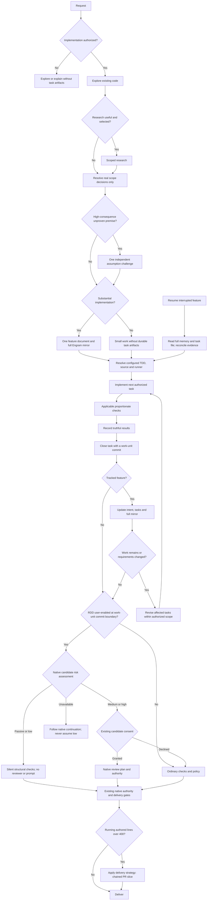
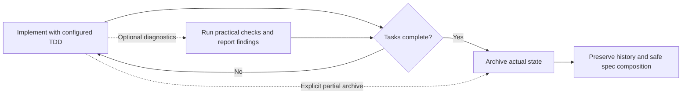

# Usage

← [Back to README](../README.md)

---

## Organic Driven Development (ODD)

ODD keeps the existing explore → implement → proportionate checks flow. For substantial, authorized implementation, the agent automatically creates one feature document after exploration; you do not need to request task tracking or choose a storage mode. Small, understood work creates no durable task artifacts. Explanation, investigation, and proposal-only requests remain read-only.

### The ODD protocol

ODD runs by default on every request, in every configured runtime, without you asking for a workflow, a plan, or task tracking; SDD is a branch inside ODD, entered only by an explicit request or an accepted proposal.

1. **Authorize** — establish whether the request authorizes a change; read-only work stays read-only.
2. **Explore** — explore the existing code and requirements first, proportionately to the request.
3. **Resolve uncertainty** — optional research for a named uncertainty, one focused question for a real product decision, at most one assumption challenge for a high-consequence unproven premise.
4. **Classify** — substantial when exploration yields two or more meaningful implementation steps or progress worth recovering; small, understood work stays small.
5. **Track before the first write** — for substantial work, create the feature document and its Engram mirror before the first source write, and tell you in one line which document was created and how many tasks it holds.
6. **Implement task by task** — route each task through the smallest useful topology with the configured TDD mode and applicable checks; check items off only with observed proof. Every task closes with at least one work-unit commit on the feature branch (branch first when on the default branch), with tests and docs alongside the behavior, using a Conventional Commit message; the feature document records the commit identity as evidence.
7. **Close** — report the verified outcome, every failed or pending check, and the next step. The native review candidate is a work-unit commit or a PR slice, never a TODO checkbox and never the accumulated feature branch.

- **One feature document:** `odd/tasks/<feature-name>.md` holds objective, problem, why, scope, constraints, an actionable checklist with stable IDs and acceptance criteria, verification evidence, progress, and next step. Keep concise rationale for meaningful accepted changes here, not a separate plan or exhaustive decision journal. Project-scoped Engram topic `odd/<feature-name>/tasks` mirrors the full current document and file locator.
- **Task size:** about 400 authored changed lines (additions plus deletions) per task is only a planning heuristic, not a task acceptance criterion, hard cap, counter-trigger, automatic stop, forced split, or RDD trigger. Keep the smallest coherent behavior with its tests and docs. If the correct, clear solution naturally exceeds it, briefly explain why and continue without size-only rework loops. Never delete spaces, blank lines, or comments for cosmetic savings, omit tests, minify, add gratuitous abstractions, or split artificially. Forward the same advisory-only instruction to delegated subagents. Existing repository policy and separate PR size gates remain unchanged.
- **Changes:** accepted user, review, or verification changes update affected intent and tasks together, preserve valid completed and unrelated work, and add new tasks or reopen invalidated tasks with a reason. Findings alone do not authorize expansion or automatic acceptance; routine corrections stay with their tasks. Checkoffs require observed outcomes and applicable proof; they are not approval or a review receipt. New business scope still needs your authorization.
- **TDD:** resolve on/off from existing project/session configuration or explicit user choice, retaining source and exact runner in the feature document when present; tests existing does not enable it. Forward mode/source/runner to every implementation worker and refresh on resume. Enabled means observed RED before implementation → GREEN → REFACTOR; disabled still runs ordinary functional checks. Unknown/conflicting mode or a missing runner needs only the clarification affecting the next action—never invented precedence, commands, or `sdd-init`.
- **Checking:** run applicable functional checks per task; a TODO checkbox does not trigger a review cycle. The native review candidate is a work-unit commit or a PR slice, never a TODO checkbox and never the accumulated feature branch. After each work-unit commit, when RDD is enabled, assess it with `gentle-ai review assess --cwd <repo> --base-ref <last reviewed boundary> --committed-only --json`. Passive or low stays silent and the boundary advances. High, or an unavailable or failed assessment, reviews the commit itself right away with the native preflight STATUS at `--base-ref <last reviewed boundary> --committed-only`. Medium defers to the PR slice, the commits accumulated since the last reviewed boundary, bounded by the delivery budget of about 400 authored changed lines, and reviews at slice close. The first boundary is the branch point, and every reviewed boundary becomes the next base. Record the assessed tier and outcome per task: granted, declined, passive, deferred to slice, or unavailable. Existing risk, consent, and authority stay unchanged; never infer low risk from a failed assessment. Never skip an existing delivery gate.
- **Delivery:** at feature-document creation, forecast authored changed lines (additions plus deletions, generated files excluded) from the task list, and keep a running count from work-unit commits. Choose one delivery strategy per feature: `ask-on-risk` (default), `auto-chain`, `single-pr`, or `exception-ok`. When the forecast or running count exceeds about 400 authored changed lines, apply the chosen strategy before the next commit. `ask-on-risk` asks once for the chain strategy (`stacked-to-main` or `feature-branch-chain`); `auto-chain` asks only for a missing chain strategy and slices automatically. Cache both choices, and record slice boundaries (which commits each PR holds) in the feature document. Resolve the `work-unit-commits` and `chained-pr` skills by registry name before planning or creating any PR.
- **RDD consent:** when enabled, native candidate risk assessment comes first: passive/low stays silent with structural checks, no reviewer, and no consent ceremony; medium/high presents existing candidate consent and runs the native review plan only on grant. Declining uses ordinary policy. Disabled RDD never starts or prompts; ordinary checks remain. This is prospective change risk, not defect severity or a model-selected threshold. Failed assessment never implies low risk; existing native continuations and authority still apply.
- **Resume:** before implementation or resume, the parent reads the full feature-specific Engram observation and actual task file, reconciles current code and evidence, and passes the locator and relevant context; the worker reads the document before edits. Read back both writes: they are not atomic. If Engram is unavailable, keep local progress and report the pending mirror; preserve conflicting versions rather than silently overwriting one.
- **Uncertainty:** research is optional, and a concise proposal is useful only for a real decision. A high-consequence unproven assumption can receive one independent read-only challenge—even in a small security-critical change. Deterministic failures need fixes, not debate; native RDD claims stay with its own refuter.

### Why ODD is the everyday recommendation

SDD adds separate proposal, spec, design, tasks, and verification artifacts with phase coordination. Choose it explicitly when those artifacts serve your work; it remains supported. ODD keeps intent, progress, and evidence in one feature document, so ordinary work does not need the extra handoffs. Size, ambiguity, or risk alone never selects SDD.

### Research depth without a new phase

ODD research establishes the problem, intended outcome, constraints, and current evidence, then inspects relevant code. Depth adapts to uncertainty and consequence: no fixed questionnaire or mandatory rounds. Only real unresolved product decisions prompt a focused user question, one at a time with a stop/wait; delegated workers return gaps to the parent rather than assume choices.

Questions needing external evidence use available authorized documentation/web tools, preferably primary sources. Findings attribute material claims to URLs or code locations and distinguish verified facts, assumptions, contradictions, freshness, and gaps. The concise handoff includes a recommendation, tradeoffs, open questions, and implementation implications. A proposal is needed only for a real decision; unavailable tools are disclosed, never invented, and only unsafe decisions dependent on missing evidence pause.

When delegated, these instructions go to an existing fresh general exploration/research worker—not a new specialized agent or `sdd-research`. Research stays read-only and introduces no SDD request/grant schema, persistence gate, readiness state, or new runtime command.



ODD adds shared agent guidance, not a new CLI, state engine, or mandatory planning phase. Instruction tests establish delivery, not autonomous compliance with every create/update/resume step. Existing risk-based functional checks and the user-owned RDD switch are unchanged; ODD never enables RDD. Explicitly selected SDD remains a separate workflow.

Gentle Shell (the `gentle-pi` package) owns its separate ODD prompt delivery. Updating Gentle AI's shared renderer does **not** establish Pi parity; parity requires observing the same file, memory, update, and resume behavior in Pi, not merely matching prompt text.

---

## Persona Modes

| Persona   | ID          | Description                                                                       |
| --------- | ----------- | --------------------------------------------------------------------------------- |
| Gentleman | `gentleman` | Teaching-oriented mentor persona — pushes back on bad practices, explains the why |
| Neutral   | `neutral`   | Same teacher, same philosophy, no regional language — warm and professional       |
| Custom    | `custom`    | Keep your existing persona/config unmanaged — gentle-ai does not inject a persona |

`custom` is a compatibility/ownership choice, not a persona editor. Use it when you already have your own persona instructions and want gentle-ai to leave them alone.

---

## Interactive TUI

Just run it — the Bubbletea TUI guides you through agent selection, components, skills, presets, and managed uninstall flows:

```bash
gentle-ai
```

The uninstall flow is also available from the TUI menu. It lets you:

- select one or more configured agents
- select which managed components to remove (for example `sdd`, `persona`, or `context7`)
- confirm the exact uninstall scope before applying changes

Before any managed file is modified, `gentle-ai` creates a backup snapshot so the configuration can be restored later if needed.

### Receipt-Driven Development during installation

Before the final installation confirmation, the customizable installer explains Receipt-Driven Development (RDD) and asks you to choose **RDD ON** or **RDD OFF**. RDD records bounded, independent review evidence for a frozen change candidate and supports a bounded correction process. It can add review time and model cost.

The choice is optional and defaults to OFF when no global preference exists. You can return from the confirmation screen to revise it. Gentle AI saves the selected global setting only after installation succeeds; an interrupted or failed installation leaves it unchanged. Existing clone-local overrides remain unchanged, so a clone's effective mode can differ from the global setting. RDD evidence does not authorize commits, pushes, pull requests, or releases; ordinary repository policy still governs delivery.

### Disable TUI spinner animation

Set `GENTLE_AI_NO_ANIMATION=1` to keep TUI spinner frames static:

```bash
GENTLE_AI_NO_ANIMATION=1 gentle-ai
```

This disables only spinner animation; install, update, sync, and uninstall operations continue normally. Unset the variable, or use any value other than `1`, to keep the default animation behavior.

---

## CLI Commands

### install

First-time setup — detects your tools, configures agents, injects all components. When installing a single agent with `--agent X`, gentle-ai **merges** the new agent into the existing `installed_agents` list in `state.json` and **preserves** any existing `model_assignments` — it does not overwrite the full state.

```bash
# Full ecosystem for multiple agents
gentle-ai install \
  --agent claude-code,opencode,gemini-cli \
  --preset full-gentleman

# Minimal setup for Cursor
gentle-ai install \
  --agent cursor \
  --preset minimal

# OpenClaw setup after installing OpenClaw manually
gentle-ai install \
  --agent openclaw \
  --preset full-gentleman

# Pick specific components and skills
gentle-ai install \
  --agent claude-code \
  --component engram,sdd,skills,context7,persona,permissions \
  --skill go-testing,skill-creator,branch-pr,issue-creation \
  --persona gentleman

# Dry-run first (preview plan without applying changes)
gentle-ai install --dry-run \
  --agent claude-code,opencode \
  --preset full-gentleman
```

### skill-registry refresh

Refresh the project-local skill registry used by orchestrators before they delegate work:

```bash
gentle-ai skill-registry refresh
gentle-ai skill-registry refresh --force
gentle-ai skill-registry refresh --cwd /path/to/project --quiet
```

The command scans project skills first (`skills/`, `.opencode/skills/`, `.claude/skills/`, `.github/skills/`, and other supported workspace skill roots), then global agent skill directories. Project-local skills win over same-name global skills.

The command writes `.atl/skill-registry.md` and `.atl/.skill-registry.cache.json`. The cache fingerprint includes schema version plus each discovered `SKILL.md` file path, mtime, and size, so normal startup is a cheap cache-hit when skills have not changed.

Codex, Claude Code, and OpenCode installs wire this command into startup/plugin hooks. Pi gets the equivalent behavior from `gentle-pi`; keep those hook/plugin scan roots in sync when changing these discovery rules.

See [Skill Registry](skill-registry.md) for the full index-first flow and diagrams.

### Community Tools

The installer’s **Community Tools/Plugins** screen offers opt-in integrations. RTK is never selected by a preset or detection. On supported macOS/Linux architectures it installs pinned RTK `v0.49.0` at `~/.local/bin/rtk`, configures only detected selected Claude Code, OpenCode, Codex CLI, and Pi agents, and disables RTK telemetry for its child processes. Windows is intentionally unavailable.

Gentle AI does not change shell profiles or `PATH`. If RTK is not found after installation, run:

```bash
export PATH="$HOME/.local/bin:$PATH"
```

Run `gentle-ai sync` to restore an explicitly persisted RTK selection using the same pinned setup. RTK removal remains the upstream manual workflow; Gentle AI does not create an ownership manifest or uninstall RTK automatically.

### sync

Refresh managed assets to the current version. Run it after replacing or upgrading the `gentle-ai` binary, including with `brew upgrade`, `gentle-ai upgrade`, or `go install`. It does NOT reinstall binaries (engram, GGA) — only updates prompt content, skills, MCP configs, and SDD orchestrators.

Managed reviewer and runtime assets are version-bound to the binary. Until sync succeeds, review lifecycle operations fail closed when managed writer provenance is missing or mismatched.

> **Important:** `gentle-ai sync` updates the agents recorded as installed by Gentle AI™, not every AI agent config directory on your machine.
>
> Gentle AI stores your selected install targets in `~/.gentle-ai/state.json`. Future `sync` runs use that stored selection so Gentle AI does not accidentally write into tools you did not choose to manage. If you rerun install and select only one agent, that new selection becomes the default sync scope.
>
> Before syncing, you can preview the active scope with `gentle-ai sync --dry-run`. If you want to sync agents outside the stored selection, pass them explicitly with `--agent`.

```bash
# Preview which agents sync will update
gentle-ai sync --dry-run

# Sync the agents currently registered in ~/.gentle-ai/state.json
gentle-ai sync

# Sync specific agents only
gentle-ai sync --agent claude-code --agent opencode

# Refresh OpenClaw workspace instructions and MCP config
gentle-ai sync --agent openclaw
```

Sync is safe and idempotent — running it twice produces no changes the second time. When files change, the summary reports the changed file count and lists the changed file paths.

`sync` refreshes the managed component set for the selected agents. It does not support `--component`; use `--include-permissions` or `--include-theme` for the opt-in components that are excluded from the default sync scope.

After upgrading the binary, `gentle-ai sync --dry-run` previews the selected targets; `gentle-ai sync` refreshes their primary remote-authorization guidance. To select a specific managed client, use e.g. `gentle-ai sync --agent opencode`. This behavioral section is delivered with unconditional routing guidance, without requiring persona, SDD, or `--include-permissions`. It requires explicit destination, operation, and credential/session authorization before remote work or ambient access discovery/reuse.

This update covers the 15 non-Pi primary instruction carriers only. Executor roles, named profiles, and Pi's package-owned instructions require separate behavioral coverage. Existing automation modes and remembered approvals may suppress runtime prompts. The guidance is not a sandbox or a fresh-human-per-execution guarantee. Shared settings merging and profile cleanup preserve existing permission-rule order.

For OpenCode native remote-command asks, opt in separately: `gentle-ai sync --agent opencode --include-permissions` (or `--agent kilocode` for the shared generated configuration). Defaults ask for direct `ssh`, `scp`, `sftp`, and `rsync`, bare or with arguments; local-only rsync also asks conservatively. Existing restrictions and explicit custom allows remain authoritative, so custom configurations may still allow remote commands. Defaults do not rewrite those personal allows. Agent overrides and remembered approvals may also bypass a prompt.

Matcher fixtures follow OpenCode [v1.2.27 wildcard matching](https://github.com/anomalyco/opencode/blob/v1.2.27/packages/opencode/src/util/wildcard.ts) and its last-matching permission evaluation. They do not prove interception of absolute executable paths, env wrappers, interpreters, or arbitrary compound shell syntax; the runtime extracts command nodes separately. Kilocode runtime equivalence is not verified. Issue #4324 remains open for all-client/all-role completion.

For OpenClaw, sync reads the active workspace from `~/.openclaw/openclaw.json` (`agents.defaults.workspace`). It writes `AGENTS.md` / `SOUL.md` into that workspace, while MCP servers stay in the global OpenClaw config under `mcp.servers`.

For Hermes, gentle-ai is detect-only: it cannot install Hermes. Install Hermes manually first. Detection is driven by the `~/.hermes` config directory (the binary being on `PATH` is reported separately). Once Hermes is detected, `gentle-ai install --agent hermes` injects context7 and Engram™ MCP blocks into `~/.hermes/config.yaml`, writes the SDD orchestrator and persona into `~/.hermes/SOUL.md`, and copies skills to `~/.hermes/skills/`. Use `gentle-ai sync --agent hermes` to update the managed configuration after upgrades.

### uninstall

Remove only the `gentle-ai` managed configuration from one or more agents. This does not uninstall external packages or binaries — it removes managed prompt sections, MCP entries, skills/config fragments, and other managed files, then updates `state.json` accordingly.

Before any change is applied, `gentle-ai` creates a backup snapshot of the affected files.

```bash
# Partial uninstall for specific agents
gentle-ai uninstall \
  --agent claude-code \
  --agent opencode

# Partial uninstall for specific components only
gentle-ai uninstall \
  --agent claude-code \
  --component sdd,persona,context7

# Complete uninstall of managed config from all supported agents
gentle-ai uninstall --all

# Skip confirmation prompt
gentle-ai uninstall --agent cursor --component skills --yes
```

If no `--component` flag is provided for a partial uninstall, `gentle-ai` removes all managed uninstallable components for the selected agent set.

### update / upgrade

Check for and install new versions of `gentle-ai` itself. The pre-upgrade backup snapshot covers only the agents recorded in `state.InstalledAgents` (`~/.gentle-ai/state.json`) — not every agent config directory that exists on your machine.

```bash
# Check if a newer version is available
gentle-ai update

# Upgrade to the latest release (downloads new binary, replaces current)
gentle-ai upgrade
```

After any upgrade or manual binary replacement, run `gentle-ai sync` to refresh all managed assets to the new version's content.

If GitHub rate-limits update checks, export `GITHUB_TOKEN` or `GH_TOKEN` before running `gentle-ai update`/`upgrade`.

If Homebrew refuses an upgrade from an untrusted tap, trust only the artifact Homebrew names and retry the upgrade:

```bash
# Formula tools, for example gentle-ai
brew trust --formula gentleman-programming/tap/gentle-ai
brew upgrade gentle-ai

# Cask tools, for example engram
brew trust --cask gentleman-programming/tap/engram
brew upgrade engram
```

If you choose to install several tools from this tap, run `brew trust gentleman-programming/tap` instead. This broader option trusts all current and future formulas, casks, and external commands published in the tap.

**Self-update prompt behavior** (changed in v1.x slice 5 — `GENTLE_AI_CONFIRM_UPDATE` removed):

| Situation | Behavior |
|-----------|----------|
| Interactive terminal (TTY) | Always prompts `Apply now? [Y/n]`. Empty Enter accepts. |
| Non-TTY (CI, pipe, script) | Auto-declines — never hangs. |
| `GENTLE_AI_YES=1` | Auto-accepts without prompting (for scripted upgrades). This variable is inherited by subprocesses, so scope it to a single invocation when needed (e.g. `GENTLE_AI_YES=1 gentle-ai …`). |
| `GENTLE_AI_NO_SELF_UPDATE=1` | Skips the self-update check entirely. |

`GENTLE_AI_CONFIRM_UPDATE` was removed in slice 5. It is now ignored if set.

`GENTLE_AI_SELF_UPDATE_DONE` is an internal loop guard and should not be set manually.

### model assignment

The TUI **Configure Models** screen can assign different models to SDD phases, `sdd-onboard`, and Judgment Day agents (`jd-judge-a`, `jd-judge-b`, `jd-fix-agent`) when the selected agent supports those slots. This lets you keep review or apply phases on stronger models while routing cheaper phases to faster models.

### doctor

Read-only ecosystem health diagnostics — no changes made to your configuration:

```bash
gentle-ai doctor
```

Checks performed:

| Check | What it verifies |
|-------|-----------------|
| Tool binaries | Required tools present on `PATH`; shadow detection (wrong binary resolves first) |
| `state.json` validity | Parses `~/.gentle-ai/state.json` and reports any schema/corruption issues |
| Engram MCP reachability | Confirms the Engram MCP server responds |
| Disk space | Warns when available space is critically low |

Each check reports **pass**, **warn**, or **fail** with an optional remedy hint. Run `doctor` first when troubleshooting an unexpected install or sync result.

### version

```bash
gentle-ai version
gentle-ai --version
gentle-ai -v
```

---

## CLI Flags (install)

| Flag                          | Description                                                                                                       |
| ----------------------------- | ----------------------------------------------------------------------------------------------------------------- |
| `--agent`, `--agents`         | Agents to configure (comma-separated)                                                                             |
| `--component`, `--components` | Components to install (comma-separated)                                                                           |
| `--skill`, `--skills`         | Skills to install (comma-separated)                                                                               |
| `--persona`                   | Persona mode: `gentleman`, `neutral`, `custom` (`custom` keeps your existing persona unmanaged)                   |
| `--preset`                    | Preset: `full-gentleman`, `ecosystem-only`, `minimal`, `custom` (`custom` means manual component/skill selection) |
| `--sdd-mode`                  | SDD orchestrator mode: `single` or `multi`                                                                        |
| `--scope`                     | Install scope for agent-scoped files: `global` (default, writes to each selected agent's global config directory) or `workspace` (writes to the current project root). Also settable via `GENTLE_AI_INSTALL_SCOPE` env var for CI/non-interactive use. |
| `--dry-run`                   | Preview the install plan without applying changes                                                                 |

## CLI Flags (sync)

| Flag                     | Description                                                                                          |
| ------------------------ | ---------------------------------------------------------------------------------------------------- |
| `--agent`, `--agents`    | Agents to sync (defaults to all installed agents)                                                    |
| `--skill`, `--skills`    | Skills to sync (comma-separated; defaults to selected preset skills)                                  |
| `--sdd-mode`             | SDD orchestrator mode: `single` or `multi`                                                           |
| `--strict-tdd`           | Enable Strict TDD Mode for SDD agents                                                                |
| `--profile`              | Create or update an SDD profile: `name:provider/model` (sets the default model for all phases)       |
| `--profile-phase`        | Override a specific phase in a profile: `name:phase:provider/model`                                  |
| `--sdd-profile-strategy` | OpenCode profile sync strategy: `generated-multi` or `external-single-active`                        |
| `--include-permissions`  | Include permissions sync (opt-in)                                                                    |
| `--include-theme`        | Include theme sync (opt-in)                                                                          |
| `--dry-run`              | Preview the sync plan without applying changes                                                       |

**Profile examples:**

```bash
# Create a "cheap" profile using a free model for all phases
gentle-ai sync --profile cheap:openrouter/qwen/qwen3-30b-a3b:free

# Override the design phase to use a stronger model
gentle-ai sync --profile-phase cheap:sdd-design:anthropic/claude-sonnet-4-20250514

# Create multiple profiles in one command
gentle-ai sync \
  --profile cheap:openrouter/qwen/qwen3-30b-a3b:free \
  --profile premium:anthropic/claude-sonnet-4-20250514

# Use compatibility mode with an external OpenCode profile manager
gentle-ai sync --agent opencode --sdd-profile-strategy external-single-active
```

See [OpenCode SDD Profiles](opencode-profiles.md) for the full guide.

## CLI Flags (uninstall)

| Flag                          | Description                                                             |
| ----------------------------- | ----------------------------------------------------------------------- |
| `--agent`, `--agents`         | Agents to uninstall managed config from (required unless using `--all`) |
| `--component`, `--components` | Managed components to remove only from the selected agents              |
| `--all`                       | Remove managed configuration from all supported agents                  |
| `--yes`, `-y`                 | Skip the confirmation prompt                                            |

---

## Typical Workflow

```bash
# First time: install everything
brew install gentleman-programming/tap/gentle-ai
gentle-ai install --agent claude-code,cursor --preset full-gentleman

# After a new release: upgrade + sync
brew upgrade gentle-ai
gentle-ai sync

# Remove only managed SDD + persona config from one agent
gentle-ai uninstall --agent claude-code --component sdd,persona

# Adding a new agent later
gentle-ai install --agent windsurf --preset full-gentleman
```

### Homebrew upgrade troubleshooting

Homebrew 6 can require explicit trust for non-official taps and, on Linux, can
sandbox builds with Bubblewrap. `gentle-ai upgrade` and `scripts/install.sh`
auto-trust only the Gentle AI formula. For the broader tap-wide trust option,
see the [update and upgrade guidance](#update--upgrade). Manual upgrades may
still need this one-time command:

```bash
brew trust --formula gentleman-programming/tap/gentle-ai
brew upgrade gentle-ai
```

On Linux, if Homebrew reports that Bubblewrap cannot create a rootless sandbox,
there is nothing for Gentle AI to install: Bubblewrap is already present, but the
host blocks the rootless namespace primitives it needs. This is a security
tradeoff and should be an explicit admin decision. If your policy allows it,
fix the host namespace policy first:

```bash
sudo sysctl -w kernel.unprivileged_userns_clone=1
sudo sysctl -w user.max_user_namespaces=28633
sudo sysctl -w kernel.apparmor_restrict_unprivileged_userns=0 || true
```

Use `HOMEBREW_NO_SANDBOX_LINUX=1 brew upgrade gentle-ai` only as a final
workaround when your distro policy forbids the namespace settings; it disables
Homebrew's Linux sandbox for that command.


---

## Dependency Management

`gentle-ai` auto-detects prerequisites before installation and provides platform-specific guidance:

- **Detected tools**: git, curl, node, npm, brew, go
- **Version checks**: validates minimum versions where applicable
- **Platform-aware hints**: suggests `brew install`, `apt install`, `pacman -S`, `dnf install`, or `winget install` depending on your OS
- **Node LTS alignment**: on apt/dnf systems, Node.js hints use NodeSource LTS bootstrap before package install
- **Dependency-first approach**: detects what's installed, calculates what's needed, shows the full dependency tree before installing anything, then verifies each dependency after installation

### Optional SDD verification and honest archive

SDD normally continues from completed implementation directly to archive. Request
`/sdd-verify` when practical diagnostics are useful; it can inspect partial work,
run applicable checks, and report real results and limitations. Configured Strict
TDD still applies to implementation and to assessment of available TDD evidence.

A missing, stale, malformed, or failed verification report is not an archive gate.
An explicit archive may close unfinished work, preserving task/report history and
reporting unresolved findings without inventing PASS or completing checkboxes.
Edit permissions, mechanical copy/move and collision checks, and native delta-spec
composition still apply. SDD does not invoke RDD; ordinary delivery policy remains.



The retired `sdd-verify-validate` command is no longer required or available;
reports are diagnostics, not certificates. Gentle Pi companion work is separate.

### Optional SDD research

After exploration, request or accept research when external evidence would clarify a real question. It remains optional even after selection: partial findings, unavailable tools or missing/divergent research metadata do not create a proposal-admission gate. The orchestrator asks focused product questions one at a time and waits; only dependent decisions pause when user input or safety-critical evidence is missing.

Collectors use only available, authorized tools and return source-attributed findings, assumptions, contradictions, freshness limits, tradeoffs and implementation implications. They do not persist state or choose for the user. Existing tool restrictions remain in force, including managed OpenCode web denial; no new access is granted by this guidance. Historical research and preproposal artifacts remain intact, without revision or cross-store equality certificates.
