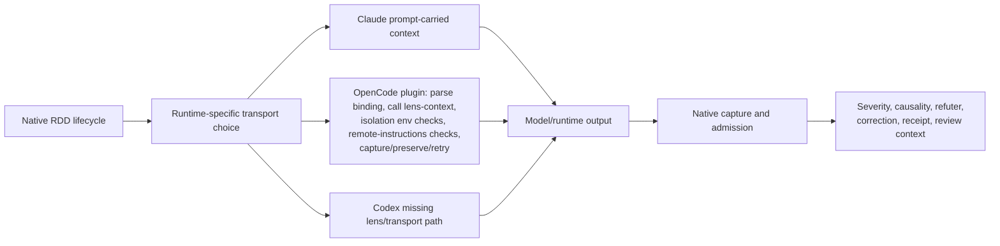
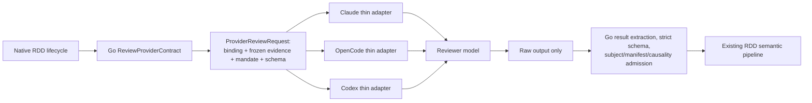

# RDD Shared Advisory Reviewer Transport

## Executive decision

Replace the runtime-specific reviewer-transport implementations with one provider-owned Go contract for prompt construction, frozen evidence, result schema, raw-result validation, and native admission. Claude Code, OpenCode, Codex, and a future compatible runtime use thin adapters that invoke a reviewer with that contract and return its raw output. The runtime/model boundary is advisory: a runtime cannot create RDD authority, mutate a review state, mint a receipt, or decide a gate.

Native Go remains the authority. After Go validates and admits a result, the existing RDD pipeline continues to decide review-lifecycle causality, severity, blocking, refutation, correction, verification, terminal receipts, and review-context evaluation. Those outputs govern review lifecycle only; ordinary repository policy and independent SDD verification govern delivery and archive.

This proposal intentionally removes the OpenCode-specific premise that receipt-grade model transport requires a restarted process, a special user-visible session, an isolated child, or either `OPENCODE_DISABLE_PROJECT_CONFIG` or `OPENCODE_DISABLE_EXTERNAL_SKILLS`. Those mechanisms exist only to establish a stronger runtime transport claim than the confirmed advisory boundary requires.

### Non-goals

- Do not weaken frozen-candidate construction, schema admission, candidate-causality checks, refutation, correction limits, terminal receipt integrity, or review-context evaluation.
- Do not create delivery authority: review receipts, gate/context outputs, and candidate identity remain review-lifecycle evidence only.
- Do not let a model or runtime select a lens, change a severity, accept a finding, consume a correction budget, or create a receipt.
- Do not turn all built-in agents into supported RDD runtimes. Capability advertisement remains evidence-based.
- Do not replace ReviewCore or rewrite the RDD lifecycle.
- Do not preserve a compatibility shim for an obsolete isolated OpenCode reviewer process unless persisted data requires reading it. Historical receipts remain readable; new runtime transport does not need the old process topology.

## Architecture

### Before



The native provider already owns most of the evidence and validation. The problem is that each runtime also interprets binding data, rebuilds or carries prompt/evidence, applies its own budget/refusal rules, and sometimes captures or preserves output. OpenCode additionally establishes a process-isolation claim before it will launch a reviewer.

### After



The contract is built from native authority, not from adapter/model values. An adapter may report transport failure or return bytes. It may not rebuild bindings, interpret a reviewer result, choose a recovery policy, or publish an artifact.

## RDD invariants

The following are explicit invariants, not intentions. This change must preserve them exactly.

1. Lens selection remains native and deterministic for the frozen candidate and risk tier.
2. Severity detection remains native: `BLOCKER`, `CRITICAL`, `WARNING`, and `SUGGESTION` retain their current meanings.
3. Candidate causality remains required for severe findings. Only introduced, behavior-activated, or worsened candidate-caused severe findings can block; pre-existing, base-only, and unknown causality do not become candidate blockers.
4. Existing deterministic versus inferential evidence classification remains unchanged.
5. Refuter behavior remains part of review completion. A shared transport changes only how the refuter receives its input and returns raw output, not its adjudication semantics.
6. Bounded correction remains bounded by the frozen correction budget and attempt rules. Transport failures do not consume correction authority.
7. Verification planning, consent, execution, evidence, and retry rules remain unchanged.
8. Terminal receipt issuance remains native, bound to the exact authority, candidate, results, and terminal state.
9. Commit, push, PR, release, and other ordinary delivery actions may surface native receipt/gate context as informational review evidence only; no review result or runtime result authorizes, denies, blocks, or routes delivery or archive.
10. Fail-closed behavior remains: malformed, incomplete, mismatched, over-budget, or unavailable reviewer input produces no admitted result and no fabricated clean receipt.
11. Historical receipt records remain readable. Existing `provider_command` and `runtime_interception` values are non-gating descriptors and must not be rewritten.

## Exact transport changes

1. Introduce one Go-owned `ReviewProviderContract` surface. It creates a typed request from the frozen authority and validates a raw reviewer response against the same native schema and admission rules.
2. Move all prompt wording, lens mandate, binding serialization, frozen tree/manifest evidence assembly, byte budgeting, result-schema rendering, JSON extraction, and transport refusals to that Go surface.
3. Make Claude Code, OpenCode, and Codex adapters invoke the reviewer with the provider request and return only raw response bytes plus a transport error/status.
4. Route raw bytes through native extraction, strict decoding, subject/inspection/manifest validation, candidate-causal verification, durable capture, and existing finalization.
5. Retire runtime-specific immutable-transport categories as routing mechanisms. Capability remains a declaration that an adapter has passed the shared contract conformance and organic-runtime evidence; it is not a claim about a runtime-enforced byte boundary.
6. Remove OpenCode restart/session/isolation requirements and the global environment-variable checks. A normal already-running OpenCode session is sufficient because its output is advisory until Go admission.
7. Stop generating or installing runtime-specific reviewer prompt/evidence logic. Runtime-specific model syntax may remain only inside the thin invocation adapter.
8. Keep the existing `ReviewerContextLevel` field readable. Before implementation, decide whether new receipts record a new non-gating `provider_contract` descriptor or omit the descriptor; do not mislabel common adapter invocation as `provider_command` or `runtime_interception`.

## Shared provider contract and thin adapter boundary

The contract should be a Go API, not a prompt convention duplicated in assets.

```go
// Illustrative boundary; naming follows repository conventions during design.
type ProviderReviewRequest struct {
    Binding       BoundReviewerSlot       // native lineage, revision, target, lens, order, subject
    Frozen        FrozenCandidateContext  // base/candidate trees and ordered manifest
    Mandate       LensMandate              // canonical lens focus
    Prompt        string                   // provider-rendered instruction and evidence
    ResultSchema  string                   // ReviewResultSchema
    ByteBudget    int
}

type ReviewerAdapter interface {
    Review(context.Context, ProviderReviewRequest) ([]byte, error)
}

func (p ProviderReviewContract) AdmitRaw(
    ctx context.Context,
    request ProviderReviewRequest,
    raw []byte,
) (reviewtransaction.LensResult, error)
```

Required contract properties:

| Property | Provider responsibility | Adapter responsibility |
|---|---|---|
| Binding | Derive exact lineage, target, revision, lens, order, subject, and repository context from native authority | Pass opaque provider data unchanged; do not parse/rebuild it |
| Evidence | Materialize base/candidate/ordered-manifest evidence from frozen authority, fully in memory | Deliver the provider prompt to the reviewer |
| Budget | Apply one byte limit before invocation; refuse rather than truncate | Return provider refusal unchanged; do not invent a local limit |
| Prompt | Render one canonical mandate, input rules, and result schema | Use runtime-specific invocation syntax only |
| Output | Extract one bounded JSON object; strictly decode and validate it | Return raw bytes; no JSON parsing, code-fence stripping, or semantic classification |
| Capture | Recompute and verify subject, inspection, manifest coverage, candidate causality, and durable artifact publication | No capture, preservation, retry budget, or receipt write |
| Failure | Produce typed native errors and status-mediated retry decisions | Report invocation failure only |

The existing native sources are the starting point rather than a new parallel system: `reviewLensContextBlock` already derives frozen evidence; `ReviewerResultSchema` is already the published schema; `RunReviewCaptureResult` and `CaptureAdmittedReviewerResult` already own strict admission and immutable publication. Consolidate these behind one provider API and delete adapter copies.

## Deletion and simplification candidates

Delete only after the provider contract has a complete test matrix and the installation migration can identify managed files. These are candidates, not instructions to delete native authority.

| Candidate | Why it becomes obsolete | Replacement / retain |
|---|---|---|
| `internal/assets/opencode/plugins/review-result-artifacts.ts` | It owns OpenCode-specific binding parsing, context injection, isolation checks, remote-config refusal, raw output parsing, capture, preservation, and retry bookkeeping. | Remove the plugin if no non-transport purpose remains. The Go contract owns prompt/evidence/admission/retry; the OpenCode adapter only invokes and returns raw output. |
| OpenCode plugin tests and organic tests in `internal/assets/review_plugin_recovery_test.go` and `e2e/organicruntime/opencode_reviewer_unsupported_e2e_test.go` | They prove the obsolete environment/session/isolation path. | Replace with ordinary-session adapter conformance and raw-output-to-native-admission E2E. |
| `openCodeProviderInjectedReviewerPrompt` and `claudeReviewerPrompt` in `internal/components/sdd/boundedreview.go` | They duplicate one reviewer input contract by runtime. | One provider-rendered prompt built from the canonical lens mandate and `ReviewerResultSchema`. |
| `reviewImmutableTransportOpenCodeProviderInjected`, `reviewImmutableTransportClaudePromptCarried`, and their runtime-routing branches | They encode implementation-specific transport claims. | One capability meaning: shared provider-contract adapter proven for that runtime. Preserve a typed unavailable outcome for unproven runtimes. |
| `ReviewBinding`, `parseBinding`, `bindingRefusal`, `verifiedLensContext`, `captureResult`, `preserveResult`, and admission-recovery maps in the OpenCode plugin | They interpret/provider-bind machine data and make capture/retry decisions outside Go. | Native typed binding and native capture/retry policy. |
| `REQUIRED_ISOLATION_ENVIRONMENT`, `missingIsolationEnvironment`, `remoteInstructionsEntries`, and related docs/tests | They exist solely to sustain an immutable runtime transport claim. | Remove. Normal runtime configuration is not an admission authority under advisory transport. |
| `ReviewerContextLevelRuntimeInterception` as a new-write path | There is no longer an adapter that replaces a caller-created context. | Keep historical read support. Decide a new non-gating common descriptor before writing new receipts. |

Do not delete `reviewLensContextBlock` behavior, `ReviewerResultSchema`, `AdmitArtifact`, `CaptureAdmittedReviewerResult`, candidate-causality checks, `CompactState.CompleteReview`, verification contracts, receipt storage, or review-context evaluation. Those are the native semantic pipeline, not transport duplication; their receipts and context outputs never become delivery authority.

## Migration slices

The sequence prevents a runtime from being advertised before it can complete the same provider contract end to end.

1. **Freeze the boundary.** Record this decision in the implementation decision record and add contract-level tests around existing native prompt/evidence/schema/admission behavior. Do not change capability advertisement.
2. **Extract the provider contract.** Create the typed Go request/raw-result admission surface from existing `reviewLensContext`, `ReviewerResultSchema`, and capture logic. Differential-test it against current native admission. Keep old adapters unreachable from the new contract until all required invariants pass.
3. **Add adapter conformance.** Implement thin Claude, OpenCode, and Codex adapters against the exact same request/response interface. Adapters must compile without binding parsers, evidence budgets, result-schema copies, artifact capture, or retry state. Codex remains unadvertised.
4. **Switch supported paths atomically.** Route Claude and OpenCode through the common contract in one change set with normal-session OpenCode proof. Remove the old OpenCode plugin and environment/session requirements in the same release slice, not after an advertised intermediate path.
5. **Prove Codex before activation.** Run the required organic Codex matrix on the shared adapter. Only then change Codex from typed unavailable to supported in the canonical support matrix and documentation.
6. **Retire historical transport code.** Remove managed plugin files, obsolete generated assets, test fixtures, policy branches, and stale support prose. Preserve historical receipt readers and migration safety for managed versus user-authored files.

No slice may advertise a runtime as shared-contract-capable while it still relies on an adapter-local prompt/evidence/parser/capture implementation. A failed adapter remains typed unavailable before lifecycle mutation; it does not enter `collect` and hope a later retry changes the runtime.

## Test plan

### Contract and adapter tests

| Test | Proof required |
|---|---|
| Provider request determinism | Same frozen state and selected slot produce byte-identical binding, prompt, manifest order, schema, and budget result. No adapter input changes them. |
| Evidence refusal | Missing frozen data, empty content-changing patch, over-budget context, reordered/missing manifest entry, or stale binding refuses before invocation and never truncates. |
| Adapter minimality | Compile/static guards prove adapters contain no candidate binding type, prompt text, schema copy, byte budget, JSON parsing, result capture, retry budget, OpenCode isolation variable, restart, or special-session branch. |
| Raw-output boundary | Each adapter can return valid raw JSON, malformed JSON, multiple objects, fenced/prose output, timeout, and transport failure. Only Go extracts/decodes/admit-or-refuses. |
| Native admission | Unknown fields, wrong subject, incomplete inspection, non-canonical/reordered paths, invalid lens/order, mismatched authority, invalid evidence class, and failed candidate causality remain rejected with no authority mutation. |
| Historical compatibility | Existing receipts with `provider_command` and `runtime_interception` remain readable and no receipt descriptor is used as a gate input. |

### RDD semantic regression tests

1. Assert low/medium/high classification selects the same lenses and order as before.
2. Assert deterministic and inferential findings retain their current classification and required proof.
3. Assert candidate-caused `BLOCKER` and `CRITICAL` findings block; pre-existing, base-only, and unknown severe findings do not become candidate blockers.
4. Assert a refuter result reaches the same native adjudication outcomes through the shared contract. Include both accepted and rejected inferential findings.
5. Assert correction budget, correction attempt count, re-verification, and correction exhaustion are unchanged. A failed adapter call must not consume a correction budget or create a correction attempt.
6. Assert completed review produces the same terminal receipt shape and informational review-context output for commit, push, PR, and release paths, without changing ordinary delivery or archive decisions.
7. Assert malformed/unavailable transport cannot issue a receipt, produce a clean result, create delivery authority, or strand a new lineage after a pre-mutation capability refusal.

### Organic runtime proof

Run one positive and one fail-closed scenario for each advertised runtime using the same provider contract:

- Claude Code: normal configured session; no `inspect-candidate` shell dependency; valid raw result is admitted.
- OpenCode: ordinary already-running session; no restart, child process, special user-visible session, or `OPENCODE_DISABLE_*` variable; valid raw result is admitted.
- Codex: remains unavailable until a real compatible-runtime test passes both positive admission and negative malformed/stale/timeout cases.

Each positive scenario must continue through receipt issuance and at least one informational review-context hook, then prove that its result does not control ordinary delivery or SDD archive. Each negative scenario must prove no source, authority, correction, receipt, commit, push, PR, or release mutation.

## Risks, stop conditions, and empirical questions

| Item | Required response |
|---|---|
| Context size differs by runtime/model | Measure request and output limits for every advertised adapter. Keep one Go budget and refuse before invocation; never silently truncate or create per-runtime hidden budgets. |
| Adapter cannot expose raw output | Stop activation for that runtime. Do not restore an adapter-local artifact parser/capture bridge as a workaround. |
| Shared prompt changes semantic outcomes | Stop if any lens-selection, severity, causality, refuter, correction, receipt, or review-context regression differs from baseline. |
| Ambiguous receipt descriptor | Stop new receipt writes until the team decides whether the non-gating context-level field is omitted or extended. Preserve old values on read. |
| OpenCode configuration injects model context | This becomes an output-quality concern, not a receipt-authority claim. It must not bypass Go validation. Do not reintroduce global disable variables merely to restore a stronger claim. |
| Transport failure retry | Move exactly-once/retry accounting to Go. Stop if a failed invocation can consume a slot, duplicate a capture, or make a raw result unrecoverable. |
| Installer migration | Stop if managed-plugin removal cannot distinguish a managed file from user-authored content. Preserve unknown files and remove only provably managed artifacts. |

Open empirical questions:

1. What is the smallest common provider-request and raw-response bound that Claude, OpenCode, and the supported Codex model tiers reliably carry without truncation?
2. Does each runtime API expose a stable raw final response independent of display formatting, tool transcripts, and code fences?
3. Should the receipt record a new descriptive `provider_contract` context level, or should the field be absent for this shared advisory path?
4. Can the existing native `review lens-context` command become an internal typed API without breaking external consumers that use its CLI output? If external callers exist, version the CLI separately rather than retaining adapter-local logic.

## Review checklist

- [ ] One Go provider contract owns prompt, evidence, schema, and raw-result validation.
- [ ] Every advertised runtime has only a thin invoke-and-return-raw adapter.
- [ ] No adapter can mint RDD authority or publish a reviewer result.
- [ ] OpenCode uses an ordinary session with no restart, child, special session, or global disable variables.
- [ ] Native RDD semantics and review-context hooks have regression proof, including refuter and correction flows; no receipt or hook output controls delivery or archive.
- [ ] Codex remains unadvertised until the shared adapter passes organic positive and negative evidence.
